<!--
CONVENÇÃO DE PRINTS DESTE README (nota para o professor, não aparece renderizada)

Cada bloco "> 📸 Print NN" abaixo marca o lugar exato onde a imagem entra, com o que
capturar e o que aquela imagem prova. Depois de salvar o arquivo em `img/`, troque o
bloco pela linha de imagem que está comentada logo abaixo dele.
-->

# 02 - Do modelo ao sistema de Machine Learning

Antes de começar, o setup do ambiente é o [Lab 01 - Setup e configuração de ambiente](../01-create-codespaces/README.md). Você usa **o mesmo Codespaces e a mesma conta AWS** de todas as aulas: aqui não se cria ambiente novo, apenas se instala o que este laboratório precisa por cima do que já existe.

Todos os comandos deste laboratório rodam **no terminal do Codespaces**. Não existe passo obrigatório de clicar no console da AWS: o console aparece duas vezes, só para você ver com os próprios olhos que o recurso que o Terraform criou existe de verdade.

> [!WARNING]
> **Pré-requisitos. Confira estes quatro itens antes de continuar:**
>
> - [ ] Lab 01 concluído (fork do repositório, Codespaces da disciplina criado, bucket `base-config-<SEU_RM>` no S3).
> - [ ] Sessão do AWS Academy Learner Lab **iniciada** (bolinha verde ao lado de "AWS").
> - [ ] Credenciais do Academy copiadas para `~/.aws/credentials` dentro do Codespaces. Elas expiram a cada 4 horas.
> - [ ] Crédito disponível no Learner Lab (este lab consome centavos de dólar; o risco real é esquecer o endpoint ligado).
>
> **Tempo estimado: 75 a 90 minutos.** A execução pura dos comandos é de ~12 minutos, sendo ~8 deles esperando a AWS treinar o modelo e subir o endpoint. O resto do tempo é você lendo, observando as saídas e anotando.

No Lab 01 você montou o ambiente. Aqui você monta a coisa em si: uma **capacidade de Machine Learning que outro sistema pode chamar**. A diferença entre um notebook com 96% de acurácia e um sistema de ML é uma cadeia de elos que precisa existir por inteiro, e cada elo deste laboratório é provado com chamada de API real, não com print de tela.

## Principais pontos de aprendizagem

- A diferença entre **treinar um modelo** e **entregar uma capacidade de predição** que alguém consegue chamar.
- Por que a computação de **treino é finita** e a de **serving é persistente**, e por que só a segunda continua na fatura depois da aula.
- Por que o caminho do artefato treinado é **lido da API que o produziu**, nunca montado à mão por convenção de pasta.
- Por que um contrato de dados só vale quando é **executável**, e o que acontece quando o rótulo vaza para o payload de inferência.
- Por que acurácia sozinha não é evidência de valor: baseline majoritário, matriz de confusão, ROC-AUC, PR-AUC e calibração.
- Por que destruir a infraestrutura e **provar** que ela não existe mais é parte do trabalho, não um bônus.

## O que você terá ao final

Um endpoint SageMaker em tempo real servindo um XGBoost treinado na sua própria conta AWS, avaliado contra 600 linhas que nunca entraram no treino, com um pacote de evidência em `artifacts/evidence/` que documenta cada elo da cadeia. E a conta limpa no fim, comprovada por varredura de API.

> [!TIP]
> Os blocos **💡 Clique para entender** são aprofundamentos opcionais. Você conclui o lab inteiro sem abrir nenhum deles, mas é neles que está o "por quê" de cada decisão. Os blocos **⚠ Se der erro** aparecem logo depois do passo que pode falhar.

## Mapa do lab

| Parte | O que você faz | Passos | Tempo |
|---|---|---|---|
| [Parte 1 - Ambiente e credenciais](#parte-1---ambiente-e-credenciais) | Reabre o Codespaces da disciplina, instala o que é específico do lab, renova a credencial do Academy e roda o portão de entrada. | [1](#passo-1) · [2](#passo-2) · [3](#passo-3) · [4](#passo-4) · [5](#passo-5) · [6](#passo-6) | ~15 min |
| [Parte 2 - Dados e contrato](#parte-2---dados-e-contrato) | Gera o dataset, inspeciona os arquivos e roda o contrato de dados. Quebra o contrato de propósito. | [7](#passo-7) · [8](#passo-8) · [9](#passo-9) · [10](#passo-10) | ~15 min |
| [Parte 3 - Provisionamento, treino e serving](#parte-3---provisionamento-treino-e-serving) | Sobe armazenamento, treino, artefato e serving com um comando, em dois estágios. | [11](#passo-11) · [12](#passo-12) · [13](#passo-13) · [14](#passo-14) · [15](#passo-15) · [16](#passo-16) · [17](#passo-17) | ~20 min |
| [Parte 4 - Chamando o modelo e medindo o que ele vale](#parte-4---chamando-o-modelo-e-medindo-o-que-ele-vale) | Chama o endpoint com dois registros, depois com as 600 linhas de teste, e lê as métricas. | [18](#passo-18) · [19](#passo-19) · [20](#passo-20) · [21](#passo-21) | ~15 min |
| [Parte 5 - O dossiê e a decisão](#parte-5---o-dossiê-e-a-decisão) | Consolida o pacote de evidência e escreve a recomendação para a área de negócio. | [22](#passo-22) · [23](#passo-23) · [24](#passo-24) | ~15 min |
| [Parte 6 - Encerramento e limpeza](#parte-6---encerramento-e-limpeza) | Destrói tudo, prova por API que nada faturável sobrou e desliga o Codespaces. | [25](#passo-25) · [26](#passo-26) · [27](#passo-27) · [28](#passo-28) | ~10 min |
| [Rodando o ciclo inteiro de novo](#rodando-o-ciclo-inteiro-de-novo) | Repete tudo com um único comando, com limpeza garantida. **Opcional**, se houver tempo em aula. | [29](#passo-29) | ~15 min |

Travou em algum passo? Clique no número na tabela acima para pular direto para ele.

---

## Contexto

> Terça-feira, 9h10. Você é a pessoa de dados da **Bora Fibra**, um provedor de internet com 180 mil assinantes. **Helena Marques, diretora de receita**, para na sua mesa com o café na mão:
>
> > *"O time de análise me mostrou um modelo que acerta quem vai cancelar. Ficou bonito na apresentação. Só que o pessoal de retenção precisa da probabilidade de cancelamento **na hora em que o cliente liga**, dentro do sistema de atendimento. Perguntei como pluga e ninguém soube responder. O modelo está no notebook de alguém. Preciso disso funcionando, e preciso saber se ele é melhor do que o chute que a gente já dá hoje."*

Existe um modelo. Não existe um sistema. É essa distância que o laboratório atravessa.

O "chute que a gente já dá hoje" tem nome técnico: **baseline majoritário**. Como 66% dos clientes da base não cancelam, dizer "ninguém cancela" para todo mundo já acerta 66% das vezes. Qualquer modelo que você entregar precisa ganhar desse chute, e você vai medir isso explicitamente.

### Pergunta-âncora do laboratório

> **Dado um cliente, qual é a probabilidade de ele cancelar, e essa resposta está disponível agora para outro sistema chamar?**

Você vai responder a essa pergunta três vezes ao longo do lab, e a resposta muda de qualidade em cada uma:

| Momento | A resposta existe? | Um sistema consegue chamar? |
|---|---|---|
| Depois do Passo 7 (dataset gerado) | Não. Só existem dados. | Não |
| Depois do Passo 13 (modelo treinado) | Sim, dentro de um arquivo `model.tar.gz` no S3. | Não. Ninguém chama um `.tar.gz`. |
| Depois do Passo 18 (endpoint respondendo) | Sim. | Sim, por HTTPS, com credencial e resposta em milissegundos. |

### Por que esta arquitetura existe

| Problema de negócio | O que ela responde bem | O que ela responde mal | Quando isso acontece na vida real |
|---|---|---|---|
| Retenção precisa do risco de cancelamento durante a ligação | "Qual a probabilidade **deste** cliente cancelar, agora, em ~50 ms" | "Qual o risco de todos os 180 mil clientes, hoje à noite" (isso é trabalho de batch, não de endpoint) | Atendimento, cobrança, antifraude: decisão individual e síncrona |
| Marketing quer priorizar uma campanha mensal | Nada. O endpoint fica ligado 24/7 esperando chamada que vem uma vez por mês | Custo por predição altíssimo. O caso pede Batch Transform | Relatório mensal, score de carteira, mala direta |

### A cadeia de capacidades

```mermaid
flowchart LR
  subgraph ARM["1 - Armazenamento (S3)"]
    A1["input/train/train.csv<br/>2.800 linhas<br/>rótulo na 1ª coluna"]
    A2["input/validation/validation.csv<br/>600 linhas"]
  end
  subgraph TRE["2 - Treino: computação FINITA"]
    B1["SageMaker Training Job<br/>1 x ml.m5.large<br/>XGBoost 1.7-1<br/>~140 s faturáveis"]
  end
  subgraph ART["3 - Artefato: durável"]
    C1["output/.../model.tar.gz<br/>24.208 bytes"]
  end
  subgraph SER["4 - Serving: computação PERSISTENTE"]
    D1["SageMaker Model"] --> D2["Endpoint Configuration"] --> D3["Endpoint em tempo real<br/>InService"]
  end
  subgraph EVI["5 - Evidência"]
    E1["Boto3 InvokeEndpoint<br/>600 linhas de teste"] --> E2["evaluation.md<br/>evidence.md"]
  end

  A1 --> B1
  A2 --> B1
  B1 -->|"escreve"| C1
  C1 -->|"URI lida da API,<br/>nunca montada à mão"| D1
  D3 --> E1

  classDef armazenamento fill:#E8F4FD,stroke:#1B6CA8,color:#0B2E4F
  classDef treino fill:#FFF4E5,stroke:#B26B00,color:#4A2C00
  classDef artefato fill:#EFE7FB,stroke:#6B3FA0,color:#2E1A47
  classDef serving fill:#FDE8EF,stroke:#ED0973,color:#5A0429
  classDef evidencia fill:#E9F7EF,stroke:#1E7E34,color:#0E3D19
  class A1,A2 armazenamento
  class B1 treino
  class C1 artefato
  class D1,D2,D3 serving
  class E1,E2 evidencia
```

Guarde a diferença de cor entre o bloco laranja e o bloco rosa, porque ela é a diferença que aparece na fatura:

- **Treino (laranja)** é computação finita. A instância sobe, treina por 140 segundos, escreve o artefato e é destruída pela própria AWS. Você paga 140 segundos e o gasto termina sozinho.
- **Serving (rosa)** é computação persistente. A instância sobe e **fica de pé esperando chamadas**, 24 horas por dia, cobrando por hora, mesmo que ninguém chame nada. Ela só para de cobrar quando alguém a destrói. Esse alguém é você, no Passo 25.

> [!CAUTION]
> **O único jeito de gastar de verdade neste laboratório é esquecer o endpoint ligado.**
>
> | Recurso | Cobra quando | Ordem de grandeza |
> |---|---|---|
> | Training job (`ml.m5.large`) | Só durante os ~140 s de execução | fração de centavo, e termina sozinho |
> | **Endpoint em tempo real (`ml.m5.large`)** | **Enquanto existir, 24/7, mesmo sem chamada** | **na casa de US$ 0,10 a US$ 0,15 por hora, ou seja, ~US$ 3 por dia e ~US$ 90 por mês** |
> | S3 (~200 KB de dados) | Armazenamento | centavos por mês |
>
> Um endpoint esquecido por duas semanas consome mais do que o crédito de US$ 50 do Learner Lab e derruba a sua conta no meio da disciplina. Valores exatos na [página de preços do SageMaker](https://aws.amazon.com/sagemaker/pricing/). O Passo 25 destrói tudo, e o Passo 26 prova que foi destruído.

<details>
<summary><b>💡 Clique para entender: por que o Terraform sozinho não consegue subir isso de uma vez</b></summary>
<blockquote>

O endpoint precisa de um `Model`, e o `Model` precisa do caminho exato do `model.tar.gz`. Esse caminho só existe **depois** que o treino termina, e quem sabe qual é ele é a API do SageMaker (`DescribeTrainingJob`), não o Terraform.

Existiria a tentação de montar o caminho por convenção: "é o bucket, mais `output/training/`, mais o nome do job, mais `output/model.tar.gz`". Funciona hoje. Quebra silenciosamente no dia em que a AWS mudar o layout, e o erro aparece como um endpoint que sobe e falha na primeira chamada, o pior lugar possível para descobrir um bug.

Por isso o lab roda em **dois estágios dentro de um único comando**:

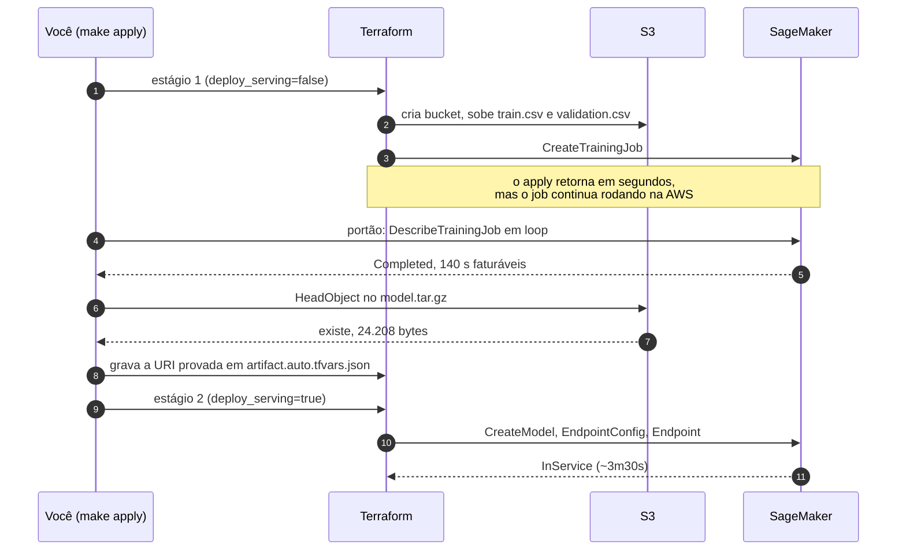

Os passos 6 e 7 dessa sequência são o coração do lab: entre "o treino terminou" e "vamos servir o modelo" existe uma **prova de existência do artefato**, feita com `s3:HeadObject`. Se o arquivo não estiver lá, o lab para ali e não cria endpoint nenhum.

</blockquote>
</details>

---

## Parte 1 - Ambiente e credenciais

### Resultado esperado desta parte

`make doctor` respondendo `[PASS] preflight` dentro do Codespaces da disciplina, com Terraform 1.15.8, Python 3.12, a conta do Learner Lab identificada, a região `us-east-1` confirmada e a `LabRole` encontrada.

> Vamos gastar 15 minutos garantindo que o ambiente está certo antes de tocar na AWS. Todo erro deste laboratório é mais barato de descobrir aqui do que depois de criar um endpoint.

<a id="passo-1"></a>

**1. Reabra o Codespaces da disciplina e entre na pasta do laboratório**

Você não cria Codespaces novo neste lab. Abra [github.com/codespaces](https://github.com/codespaces) e clique no ambiente que você criou no Lab 01, derivado do **seu fork** de `FIAP-Cloud-Based-Machine-Learning`. Se ele estiver `Stopped`, o próprio clique o religa — leva cerca de 30 segundos.

Com o terminal aberto, puxe a versão mais recente do repositório e entre na pasta deste laboratório:

```bash
cd /workspaces/FIAP-Cloud-Based-Machine-Learning
git pull origin master
cd 02-ml-system
```

> 📸 **Print 01 — `img/01-codespaces-existente.png`**
> Capture a lista em `github.com/codespaces` com o ambiente da disciplina destacado (estado `Running` ou `Stopped`). Prova que o laboratório começa reabrindo o ambiente que já existe, e não criando outro — que é o erro número um desta parte.

<!-- 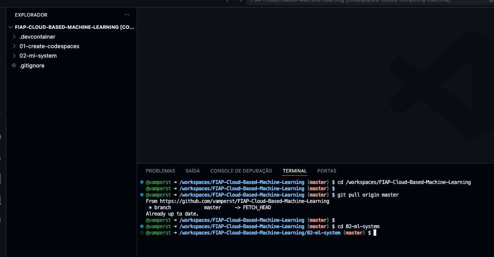 -->

<details>
<summary><b>💡 Clique para entender: por que um Codespaces só para toda a disciplina</b></summary>
<blockquote>

Construir um Codespaces do zero custa de 10 a 15 minutos, porque o ambiente baixa a imagem Ubuntu, aplica as ferramentas e roda o script de pós-criação. Se cada laboratório tivesse o seu, a turma gastaria esse tempo em toda aula — e uma parte dela ficaria travada em problemas de criação em vez de arquitetura de ML.

O desenho da disciplina separa duas camadas:

1. **O ambiente base**, definido em [`.devcontainer/`](../.devcontainer/README.md) na raiz do repositório, criado uma única vez no Lab 01: Ubuntu 24.04, Python 3.12, AWS CLI, Terraform 1.15.8, Node LTS, Docker e `make`.
2. **O específico de cada lab**, instalado por um script dentro do ambiente que já existe — o Passo 2 aqui.

O efeito colateral bom é que o que você fez em aulas anteriores continua no disco: os artefatos, o histórico do terminal e os arquivos que você editou estão todos lá quando você reabre.

</blockquote>
</details>

<details>
<summary><b>⚠ Se der erro no <code>git pull</code>: <code>Your local changes would be overwritten by merge</code></b></summary>
<blockquote>

Você tem alterações locais de um lab anterior. Se quiser preservá-las, use `git stash`, depois `git pull origin master`, depois `git stash pop`. Se for lixo de exercício antigo, descarte com `git checkout .` antes do pull.

</blockquote>
</details>

---

<a id="passo-2"></a>

**2. Instale o que este laboratório precisa, dentro do Codespaces**

O ambiente base já tem Terraform, AWS CLI, Python e `make`. Falta o que é exclusivo deste lab: o ambiente virtual Python com as bibliotecas nas versões exatas que a aula validou. Um script faz isso:

```bash
bash scripts/setup.sh
```

Saída esperada (leva de 40 a 90 segundos na primeira vez):

```text
==> terraform 1.15.8 já disponível
==> criando .venv com as versões de requirements.txt
==> terraform : Terraform v1.15.8
==> python    : Python 3.12.14
==> aws cli   : aws-cli/2.36.29 Python/3.14.6 Linux/6.12.76-linuxkit exe/aarch64.ubuntu.24
==> pronto. Próximo passo: make doctor
```

A linha do AWS CLI termina com a arquitetura da máquina e a versão do kernel, então ela muda de ambiente para ambiente (`x86_64` no Codespaces, `aarch64` em Mac com Apple Silicon). As duas linhas que precisam bater são `Terraform v1.15.8` e `Python 3.12` — a versão de patch do Python pode variar dentro da série.

> 📸 **Print 02 — `img/02-setup-do-lab.png`**
> Capture o terminal com a saída completa de `bash scripts/setup.sh`, das primeiras linhas até `pronto. Próximo passo: make doctor`. Prova as três versões que o laboratório exige — Terraform 1.15.8, Python 3.12 e AWS CLI — vindas do próprio ambiente do aluno.

<!-- 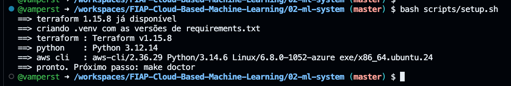 -->

<details>
<summary><b>💡 Clique para entender: o que o script instala e por que ele é seguro rodar de novo</b></summary>
<blockquote>

O `scripts/setup.sh` faz duas coisas, nesta ordem:

1. **Confere o Terraform.** Se a versão instalada não for exatamente a **1.15.8**, ele baixa o binário oficial e verifica o **SHA-256** contra o checksum publicado pela HashiCorp, que está versionado dentro do script. Se a HashiCorp trocar o artefato remoto, a instalação falha em vez de instalar silenciosamente algo diferente do que a aula validou. Em um Codespaces criado com a configuração atual do repositório, essa etapa só imprime que a versão já está disponível.
2. **Cria o `.venv`** com as versões exatas de `requirements.txt` (boto3, numpy, scikit-learn, PyYAML).

Ele é **idempotente**: rodar duas vezes não quebra nada e não repete o que já está certo. Isso importa porque o mesmo Codespaces atravessa a disciplina inteira — na próxima aula, o script de outro lab instala apenas o delta daquele lab.

Versão pinada não é preciosismo: é o que faz o número que aparece na sua tela ser o mesmo que aparece na tela do colega ao lado.

</blockquote>
</details>

<details>
<summary><b>⚠ Se der erro: <code>terraform: command not found</code> depois do script</b></summary>
<blockquote>

Acontece quando o `PATH` da sessão do terminal foi montado antes da instalação. Abra um terminal novo (`Terminal` → `New Terminal`) e confira:

```bash
terraform version
.venv/bin/python --version
```

Saída esperada:

```text
Terraform v1.15.8
on linux_amd64
Python 3.12.14
```

A segunda linha descreve a arquitetura da máquina e pode variar (`linux_amd64` no Codespaces, `linux_arm64` em Mac com Apple Silicon). As outras duas precisam bater — a versão de patch do Python pode variar dentro da série 3.12.

Se o `terraform` continuar ausente, seu Codespaces é anterior à configuração atual do repositório e a instalação do binário falhou. Rode `bash scripts/setup.sh` de novo e leia a mensagem de erro: quase sempre é rede ou o `sudo` do `install`.

</blockquote>
</details>

---

<a id="passo-3"></a>

**3. Copie as credenciais do Learner Lab para dentro do Codespaces**

As credenciais do Learner Lab valem **4 horas**. As que você colou na aula passada certamente expiraram, então o ritual é sempre o mesmo: sessão nova no Academy, credencial nova no Codespaces. Abra o arquivo de credenciais:

```bash
code ~/.aws/credentials
```

Na aba do AWS Academy, com o laboratório iniciado (bolinha verde), clique em `AWS Details` no canto superior direito e depois em `Show` na seção `AWS CLI`. Copie o bloco inteiro, cole no arquivo aberto no Codespaces e salve com `Ctrl+S` (ou `Cmd+S`).

> 📸 **Print 03 — `img/03-credenciais-coladas.png`**
> Capture o arquivo `~/.aws/credentials` aberto no editor do Codespaces com o bloco colado, **cobrindo ou desfocando os valores de `aws_access_key_id`, `aws_secret_access_key` e `aws_session_token`**. Prova onde o arquivo fica e qual é o formato esperado, sem expor credencial em material didático.

<!--  -->

> [!IMPORTANT]
> **A credencial do Academy vale 4 horas.** Ao voltar ao laboratório em outro dia, ou depois de um `End Lab`, repita este passo. Sinal típico de credencial vencida: qualquer comando da AWS responder `ExpiredToken` ou `InvalidClientTokenId`. Nenhum script deste lab imprime chave, segredo ou token em tela, então a única cópia visível é a que você acabou de colar.

---

<a id="passo-4"></a>

**4. Confirme que a credencial responde**

```bash
aws sts get-caller-identity
```

Saída esperada: um JSON com `UserId`, `Account` (o número de 12 dígitos da sua conta do Learner Lab) e `Arn` terminando em `assumed-role/voclabs/user...`.

Este é o primeiro **go/no-go** do laboratório: se este comando falhar, nada adiante funciona. Volte ao Passo 3.

---

<a id="passo-5"></a>

**5. Conheça a superfície de comandos do laboratório**

```bash
cd /workspaces/FIAP-Cloud-Based-Machine-Learning/02-ml-system
make help
```

Saída esperada:

```text
Lab 1 - From Model to Machine Learning System

  help           Show available targets
  doctor         Check tool versions and AWS credentials/region/role
  data           Generate the deterministic dataset
  fmt            Format Terraform (check in CI, rewrite locally)
  validate       terraform init + validate
  plan           Plan the current stage
  apply          Provision storage + training, then serving (single command, two stages)
  predict        Deterministic smoke inference
  evaluate       Score the held-out test set through the endpoint
  evidence       Build the evidence package
  destroy        Destroy every managed resource
  verify-clean   Prove no billable serving resource remains
  e2e            Full lifecycle with failure-safe cleanup (KEEP_RESOURCES=1 to skip destroy)
  clean          Remove generated local artifacts (never touches AWS)

  Full lifecycle:  make e2e
  Keep resources:  make e2e KEEP_RESOURCES=1   (you must run make destroy later)
```

São 14 comandos, e é a lista inteira do laboratório. Nada acontece por baixo do pano: cada um deles é uma linha de `terraform` ou de `python scripts/...` que você pode abrir e ler no `Makefile`.

---

<a id="passo-6"></a>

**6. Rode o portão de entrada**

```bash
cd /workspaces/FIAP-Cloud-Based-Machine-Learning/02-ml-system
make doctor
```

Saída esperada (o número da conta é o da sua conta, e o `caller` traz o seu usuário do Academy):

```text
== tool versions ==
Terraform v1.15.8
on linux_amd64
Python 3.12.11
boto3 1.43.73 botocore 1.43.73 numpy 2.5.2 scikit-learn 1.9.0
== aws preflight ==
AWS preflight
  account          : 123456789012
  caller           : arn:aws:sts::1234****9012:assumed-role/voclabs/user1234567=
  region           : us-east-1 (required us-east-1)
  execution role   : arn:aws:iam::1234****9012:role/LabRole
  lab bucket to use: prb-cloud-ml-lab1-123456789012
  credentials are never printed by this lab
[PASS] preflight
```

> 📸 **Print 04 — `img/04-make-doctor.png`**
> Capture o terminal desde `== tool versions ==` até `[PASS] preflight`, com o número da conta visível. Prova que o toolchain está na versão pinada, que a credencial responde, que a região é `us-east-1` e que a `LabRole` existe. É a foto do único portão que separa o aluno de gastar dinheiro em ambiente errado.

<!-- 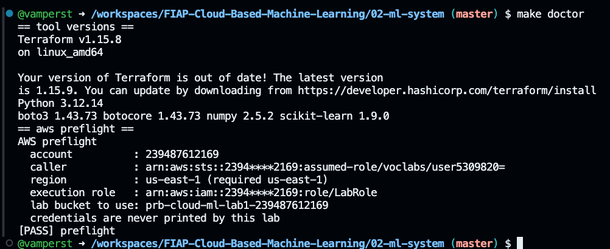 -->

<details>
<summary><b>💡 Clique para entender: o que o portão verifica e por que ele existe antes de tudo</b></summary>
<blockquote>

O `doctor` faz quatro perguntas e responde todas antes de criar qualquer recurso:

| Pergunta | Como ele verifica | Por que importa |
|---|---|---|
| O toolchain é o que a aula validou? | `terraform version`, versão do Python e das bibliotecas | Terraform em outra versão gera plano diferente; biblioteca em outra versão muda métrica na última casa decimal |
| A credencial responde? | `sts:GetCallerIdentity` | Credencial vencida do Academy é a falha mais comum, e o erro dela no meio de um `apply` é bem mais confuso |
| A região é `us-east-1`? | Compara a região da sessão com a exigida em `config/lab.yaml` | O Learner Lab só libera recursos em `us-east-1`. Em outra região a criação falha com mensagem de permissão, que parece problema de IAM e não é |
| A `LabRole` existe? | `iam:GetRole` | O SageMaker precisa assumir uma role para ler o S3 e escrever o artefato. O Academy não permite criar IAM, então o lab usa a role pré-existente |

Repare no `caller`: o número da conta aparece mascarado (`1234****9012`). O laboratório inteiro segue essa regra, e nenhum script imprime credencial.

</blockquote>
</details>

<details>
<summary><b>⚠ Se der erro: <code>session region is X but this lab requires 'us-east-1'</code></b></summary>
<blockquote>

O seu arquivo de configuração da AWS está apontando para outra região. Force a região correta e rode de novo:

```bash
aws configure set region us-east-1
cd /workspaces/FIAP-Cloud-Based-Machine-Learning/02-ml-system
make doctor
```

</blockquote>
</details>

<details>
<summary><b>⚠ Se der erro: <code>NoSuchEntity</code> ao procurar a <code>LabRole</code></b></summary>
<blockquote>

A `LabRole` é criada pelo próprio AWS Academy. Se ela não existe, a credencial que você colou provavelmente não é a do Learner Lab (pode ser de uma conta pessoal, ou de outro laboratório do Academy).

Confirme em qual conta você está e compare com o número que aparece no AWS Academy:

```bash
aws sts get-caller-identity --query Account --output text
```

</blockquote>
</details>

### Checkpoint

- [x] `terraform version` responde `v1.15.8`.
- [x] `aws sts get-caller-identity` responde sem erro.
- [x] `make doctor` termina com `[PASS] preflight`.

Se os três estão de pé, você já não corre mais risco de errar por ambiente. Nenhum recurso foi criado na AWS até aqui, e nada foi cobrado.

---

## Parte 2 - Dados e contrato

### Resultado esperado desta parte

Seis arquivos em `artifacts/data/`, com impressão digital SHA-256 registrada, e o contrato de dados aprovando as 48 verificações que ele faz sobre esses arquivos.

> A parte que mais parece burocrática é a que mais evita retrabalho. Vamos gerar os dados, olhar o que foi gerado, rodar o contrato e depois quebrá-lo de propósito, para ver o contrato pegando o erro.

<a id="passo-7"></a>

**7. Gere o dataset**

```bash
cd /workspaces/FIAP-Cloud-Based-Machine-Learning/02-ml-system
make data
```

Saída esperada, literalmente igual à sua (com exceção do caminho, que traz o nome do seu fork):

```text
[data] seed=20260817 rows=4000 out=/workspaces/FIAP-Cloud-Based-Machine-Learning/02-ml-system/artifacts/data
[data] seed 20260817 schema 1.0.0
[data] source 4000 rows, prevalence 0.3375
[data] train       2800 rows  prevalence 0.3375  2013b9725797
[data] validation   600 rows  prevalence 0.338333  18a0ddc5d4d8
[data] test         600 rows  prevalence 0.336667  04c4fdee573f
[data] written to /workspaces/FIAP-Cloud-Based-Machine-Learning/02-ml-system/artifacts/data
```

> 📸 **Print 05 — `img/05-make-data.png`**
> Capture as sete linhas acima, com os três prefixos de hash (`2013b9725797`, `18a0ddc5d4d8`, `04c4fdee573f`) legíveis. Prova que o dataset é reprodutível e serve de referência para o aluno comparar com o colega.

<!-- 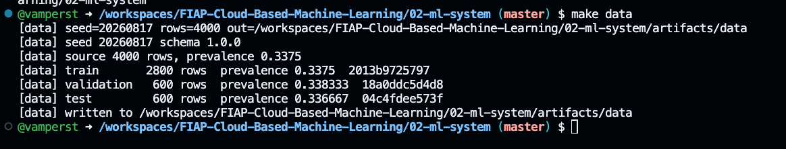 -->

**Compare com um colega agora.** Os três prefixos de hash e as três prevalências precisam ser idênticos aos dele. Se divergirem, alguém alterou o gerador ou a configuração, e todas as métricas do resto do laboratório vão divergir também.

<details>
<summary><b>💡 Clique para entender: o que são esses 4.000 clientes e por que eles não são reais</b></summary>
<blockquote>

O dataset é sintético e representa a base da Bora Fibra com sete características por cliente:

| Coluna | Significado | Faixa possível |
|---|---|---|
| `tenure_months` | meses de casa | 1 a 72 |
| `monthly_charges` | valor da mensalidade | 20,00 a 260,00 |
| `support_calls_90d` | chamados de suporte nos últimos 90 dias | 0 a 30 |
| `payment_delay_days` | atraso médio de pagamento, em dias | 0,0 a 45,0 |
| `usage_score` | score de uso do serviço | 5,0 a 100,0 |
| `annual_contract` | 1 se o contrato é anual | 0 ou 1 |
| `premium_plan` | 1 se o plano é premium | 0 ou 1 |
| `churn` | **o que queremos prever**: 1 se o cliente cancelou | 0 ou 1 |

Ele é sintético por dois motivos práticos. Primeiro, dado real de cliente não pode circular em material de aula. Segundo, e mais importante para o laboratório: como ele nasce de uma semente fixa, **todo aluno obtém exatamente os mesmos números** em todas as etapas seguintes. Isso transforma a comparação com o colega em ferramenta de autocorreção. Em um dataset com amostragem aleatória, você nunca saberia se o 0,76 de acurácia do colega é o mesmo fenômeno que o seu 0,74.

A relação entre as características e o cancelamento foi construída para ser aprendível mas não trivial: cliente novo, com mensalidade alta, muitos chamados de suporte e atraso de pagamento tem risco alto; contrato anual e plano premium seguram. Aproximadamente um terço da base cancela (`prevalence 0.3375`), o que deixa o baseline majoritário em 66%, um adversário respeitável.

</blockquote>
</details>

---

<a id="passo-8"></a>

**8. Olhe os arquivos que foram gerados**

```bash
cd /workspaces/FIAP-Cloud-Based-Machine-Learning/02-ml-system
ls -la artifacts/data
```

Saída esperada: seis arquivos.

```text
dataset_manifest.json
model_test_features_headerless.csv
model_train_headerless.csv
model_validation_headerless.csv
source.csv
test_labels.csv
```

Agora compare a **primeira linha** de três deles, porque a diferença entre eles é o conteúdo conceitual mais importante desta parte:

```bash
cd /workspaces/FIAP-Cloud-Based-Machine-Learning/02-ml-system
head -1 artifacts/data/source.csv
head -1 artifacts/data/model_train_headerless.csv
head -1 artifacts/data/model_test_features_headerless.csv
```

Saída esperada:

```text
observation_id,tenure_months,monthly_charges,support_calls_90d,payment_delay_days,usage_score,annual_contract,premium_plan,churn
1,14,125.51,3,1.11,84.04,1,0
15,87.81,1,10.45,70.33,1,0
```

Três arquivos, três formatos, e cada um serve um propósito diferente:

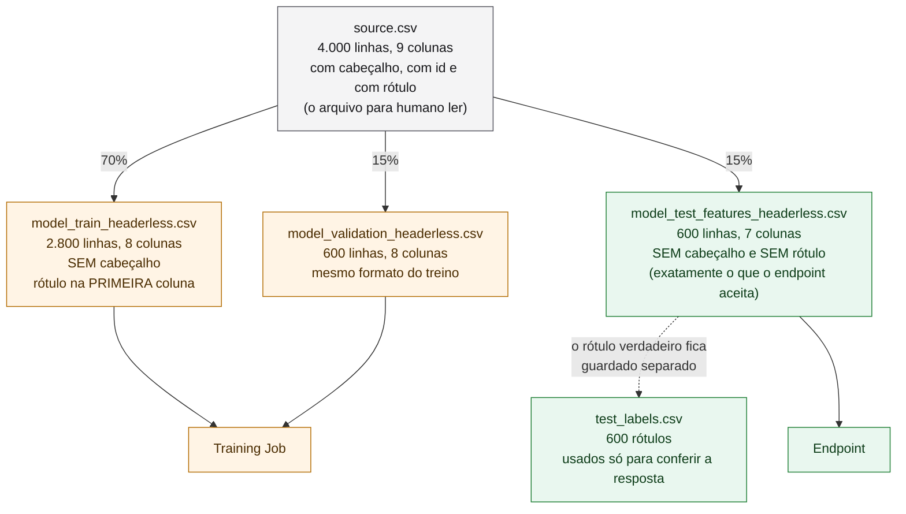

<details>
<summary><b>💡 Clique para entender: por que o arquivo de teste tem uma coluna MENOS</b></summary>
<blockquote>

O XGBoost gerenciado do SageMaker tem duas expectativas rígidas, e elas são diferentes entre treino e inferência:

- **No treino**, ele espera CSV sem cabeçalho com o **rótulo na primeira coluna**. São 8 colunas: 1 rótulo + 7 características.
- **Na inferência**, ele espera CSV sem cabeçalho e **sem rótulo nenhum**. São 7 colunas, na mesma ordem do treino.

Parece detalhe de formato. É a origem de duas das falhas mais caras em projetos de ML:

1. **Vazamento de rótulo.** Se o arquivo de inferência tiver 8 colunas, o modelo recebe a resposta como se fosse uma característica. A métrica fica espetacular no laboratório e o sistema erra tudo em produção, porque em produção ninguém sabe se o cliente vai cancelar (é exatamente isso que se quer prever).
2. **Ordem das colunas.** O modelo não recebe nome de coluna, apenas posição. Se `monthly_charges` e `support_calls_90d` trocarem de lugar entre o treino e a chamada, o endpoint responde com toda a confiança do mundo, e responde errado. Nenhum erro é levantado, porque tecnicamente a chamada é válida.

É por isso que a ordem das características vive em um único lugar (`config/lab.yaml`), é registrada no manifesto do dataset e é verificada pelo contrato. O `observation_id` também sai dos arquivos de modelo: ele identifica a linha para você, e não tem nada a dizer sobre cancelamento. Deixá-lo entrar é dar ao modelo a chance de "aprender" que o cliente número 3.900 cancela.

</blockquote>
</details>

---

<a id="passo-9"></a>

**9. Rode o contrato de dados**

O contrato é código executável, não documento. Rode:

```bash
cd /workspaces/FIAP-Cloud-Based-Machine-Learning/02-ml-system
PYTHONPATH=src .venv/bin/python scripts/validate_data.py > artifacts/contrato.json
```

Saída esperada em tela (é longa; estas são a primeira e as últimas linhas):

```text
data contract: 48 checks against /workspaces/FIAP-Cloud-Based-Machine-Learning/02-ml-system/artifacts/data
  [PASS] files.present: all 6 files present in ...
  [PASS] schema.serving_contract: serving: {'content_type': 'text/csv', 'header': False, 'label_present': False, 'column_count': 7}
  [PASS] schema.training_contract: training: {'content_type': 'text/csv', 'header': False, 'label_present': True, 'label_position': 'first', 'column_count': 8}
  ...
  [PASS] payload.roundtrip_matches_file: 600 rows re-serialise byte-identically
  [PASS] payload.smoke_shape: smoke records ['high_risk', 'low_risk'] -> 2 lines of 7 columns
[PASS] 0 of 48 checks failed
```

> 📸 **Print 06 — `img/06-contrato-48-checks.png`**
> Capture o final da saída, com a linha `[PASS] 0 of 48 checks failed` e ao menos as três verificações de `schema.*` visíveis. Prova que o contrato é executável e que ele conhece a diferença entre o formato de treino (8 colunas, rótulo primeiro) e o de serving (7 colunas, sem rótulo).

<!-- 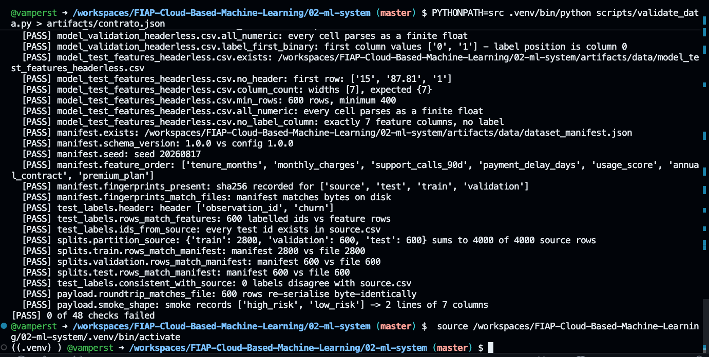 -->

Repare no redirecionamento `> artifacts/contrato.json`: a narração que você vê na tela é o canal de diagnóstico, e o **resultado** do contrato é um JSON que ficou no arquivo. Todo script deste laboratório segue essa convenção, o que permite encadear qualquer um deles em automação sem parsear texto de log.

---

<a id="passo-10"></a>

**10. Quebre o contrato de propósito**

Um contrato que nunca reprovou nada não é confiável. Vamos adicionar um cliente a mais no arquivo de origem, sem mexer em nada mais, e ver o que acontece:

```bash
cd /workspaces/FIAP-Cloud-Based-Machine-Learning/02-ml-system
echo '9999,12,99.90,2,3.00,50.00,1,1,1' >> artifacts/data/source.csv
PYTHONPATH=src .venv/bin/python scripts/validate_data.py > /dev/null
```

Saída esperada (três reprovações, e o comando termina com código de erro):

```text
  [FAIL] source.row_count: 4001 rows, expected 4000
  [FAIL] manifest.fingerprints_match_files: mismatched: ['source']
  [FAIL] splits.partition_source: {'train': 2800, 'validation': 600, 'test': 600} sums to 4000 of 4001 source rows
[FAIL] 3 of 48 checks failed
```

Uma linha a mais em um arquivo de 4.000 disparou três alarmes diferentes: a contagem não fecha, a impressão digital não corresponde mais ao que o manifesto registrou, e a soma das divisões deixou de cobrir a origem. Note que o contrato não sabe **o que** você fez, e ainda assim descreve o sintoma com precisão suficiente para o diagnóstico.

Agora restaure o dataset:

```bash
cd /workspaces/FIAP-Cloud-Based-Machine-Learning/02-ml-system
make data
PYTHONPATH=src .venv/bin/python scripts/validate_data.py > /dev/null
```

A última linha precisa voltar a ser `[PASS] 0 of 48 checks failed`. O `make data` regenera tudo do zero a partir da semente, então os hashes voltam a ser os mesmos do Passo 7.

<details>
<summary><b>💡 Clique para entender: por que isso roda ANTES de tocar na AWS</b></summary>
<blockquote>

O contrato roda inteiro na sua máquina, em menos de um segundo, sem credencial e sem custo. O training job custa dinheiro e leva minutos.

A ordem importa: um dataset que falha no contrato **nunca chega a virar training job**. Você não paga computação para treinar em cima de dados que ninguém conferiu, e não descobre o problema 8 minutos depois, olhando uma métrica estranha e sem saber se a culpa é do dado, do hiperparâmetro ou do código.

Essa é a versão prática de "falhe cedo, falhe pequeno": a verificação mais barata vem primeiro, e cada etapa seguinte só recebe entrada que já passou pela anterior.

</blockquote>
</details>

### Checkpoint

- [x] `artifacts/data/` tem os seis arquivos.
- [x] Os prefixos de hash do Passo 7 são iguais aos do seu colega.
- [x] O contrato responde `[PASS] 0 of 48 checks failed`.
- [x] Você viu o contrato reprovar de verdade no Passo 10 e voltar a aprovar depois do `make data`.

Continua sem nenhum recurso criado na AWS, e continua custando zero.

---
## Parte 3 - Provisionamento, treino e serving

### Resultado esperado desta parte

Um bucket S3 com os dados, um training job **concluído**, um `model.tar.gz` de verdade no S3 e um endpoint no estado `InService` — tudo saindo de um único `make apply`, que por dentro são dois estágios de Terraform com um portão entre eles.

> [!CAUTION]
> **A partir do Passo 12 você começa a gastar.** O training job custa uma fração de centavo e se encerra sozinho. O endpoint, a partir do Passo 14, cobra por hora até você destruí-lo. Se a aula terminar antes da Parte 6, rode `make destroy` de qualquer forma: você pode recriar tudo depois com um comando.

<a id="passo-11"></a>

**11. Leia o plano antes de criar nada**

```bash
cd /workspaces/FIAP-Cloud-Based-Machine-Learning/02-ml-system
make plan
```

A saída é longa porque descreve cada atributo de cada recurso. A linha que interessa está no fim:

```text
Plan: 9 to add, 0 to change, 0 to destroy.
```

Nove recursos, e nenhum deles é um endpoint. Confira também esta linha nas mudanças de saída:

```text
  + deploy_serving       = false
```

Esse é o laboratório dizendo, em texto, que o estágio atual **não** inclui serving. Vale a pena passar os olhos nos nove recursos: um `random_id` (o sufixo do ciclo de vida), o bucket e suas quatro configurações de segurança, dois objetos de metadados, dois objetos de dados e o training job.

<details>
<summary><b>💡 Clique para entender: por que o <code>make plan</code> vem antes do <code>make apply</code></b></summary>
<blockquote>

O `plan` é o que diferencia infraestrutura como código de script de criação. Ele responde "o que vai acontecer se eu aplicar isso agora?" sem tocar em nada, comparando três coisas: o código que você tem, o estado que o Terraform registrou e a realidade da conta AWS.

Nesta primeira vez, `9 to add` é esperado, porque a conta está vazia. O valor real do `plan` aparece depois: se você rodar `make plan` novamente com tudo já criado, ele responde `No changes`. E se alguém mexer no console, ele mostra exatamente o que divergiu.

Ler o plano é um hábito de engenharia, não uma etapa opcional do laboratório. Em ambiente real, é onde você descobre que uma mudança aparentemente inofensiva vai **destruir e recriar** um recurso com estado.

</blockquote>
</details>

---

<a id="passo-12"></a>

**12. Aplique o primeiro estágio: armazenamento e treino**

```bash
cd /workspaces/FIAP-Cloud-Based-Machine-Learning/02-ml-system
make apply
```

> [!IMPORTANT]
> Este comando leva de 7 a 9 minutos e **não deve ser interrompido**. Ele executa os dois estágios em sequência, com o portão no meio. Deixe rodando e acompanhe a saída, que é justamente o conteúdo dos próximos três passos.

A primeira coisa que aparece é o cabeçalho do estágio 1 e, no fim dele, a criação dos nove recursos:

```text
== stage 1/2: storage and training job ==
...
random_id.lifecycle: Creation complete after 0s [id=DKmJXQ]
aws_s3_bucket.lab: Creation complete after 4s [id=prb-cloud-ml-lab1-123456789012]
aws_s3_object.schema: Creation complete after 1s [id=.../metadata/schema.json]
aws_s3_object.manifest: Creation complete after 1s [id=.../metadata/dataset_manifest.json]
aws_s3_object.validation: Creation complete after 1s [id=.../input/validation/validation.csv]
aws_s3_object.train: Creation complete after 1s [id=.../input/train/train.csv]
aws_sagemaker_training_job.churn: Creation complete after 1s

Apply complete! Resources: 9 added, 0 changed, 0 destroyed.
```

> 📸 **Print 07 — `img/07-apply-stage1.png`**
> Capture do cabeçalho `== stage 1/2: storage and training job ==` até a linha `Apply complete! Resources: 9 added, 0 changed, 0 destroyed.`. Prova que o armazenamento e o training job foram criados, e que nenhum recurso de serving entrou neste estágio.

<!-- 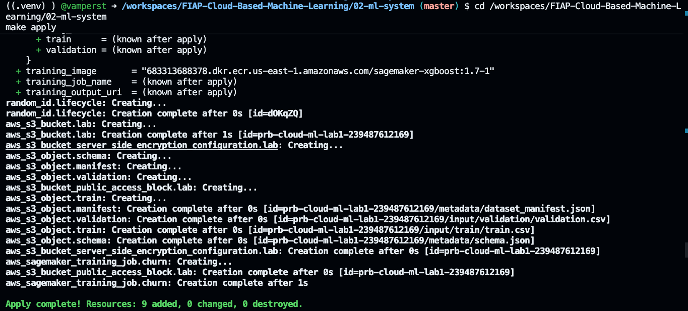 -->

Repare em `aws_sagemaker_training_job.churn: Creation complete after 1s`. O Terraform criou o job em 1 segundo, mas o treino **não** terminou em 1 segundo. O que terminou foi a **submissão**: o Terraform pediu à AWS "comece a treinar" e a AWS respondeu "aceito". O treino roda de forma assíncrona, e é isso que o próximo passo resolve.

<details>
<summary><b>⚠ Se der erro: <code>ExpiredToken</code> no meio do apply</b></summary>
<blockquote>

A credencial do Academy venceu durante a execução. Renove-a (Passo 3) e rode `make apply` de novo: o Terraform já registrou o que conseguiu criar e continua de onde parou, sem duplicar recurso.

Se o training job foi submetido antes do vencimento, ele continua rodando na AWS de forma independente — a credencial expirada só impede que **você** consulte o status, não que a AWS treine.

</blockquote>
</details>

<details>
<summary><b>⚠ Se der erro: <code>BucketAlreadyOwnedByYou</code> ou o bucket já existe</b></summary>
<blockquote>

Você já rodou o laboratório antes e o bucket sobrou de um ciclo anterior. O nome do bucket é derivado da sua conta, então ele é estável entre execuções. Duas saídas:

```bash
# opção 1: destruir o ciclo anterior por completo e recomeçar
cd /workspaces/FIAP-Cloud-Based-Machine-Learning/02-ml-system
make destroy && make apply
```

Se o estado do Terraform também foi perdido (por exemplo, Codespaces recriado), esvazie e apague o bucket manualmente antes:

```bash
BUCKET=prb-cloud-ml-lab1-$(aws sts get-caller-identity --query Account --output text)
aws s3 rm "s3://$BUCKET" --recursive
aws s3 rb "s3://$BUCKET"
```

</blockquote>
</details>

---

<a id="passo-13"></a>

**13. Leia o portão: o momento em que o modelo se torna um artefato**

Sem que você digite nada, o `make apply` segue para o portão. Esta é a parte mais importante do laboratório inteiro:

```text
== gate: wait for the training job and prove the artifact exists ==
[wait] waiting for training job prb-cloud-ml-lab1-train-a1b2c3d4
[training] prb-cloud-ml-lab1-train-a1b2c3d4: InProgress / Starting
[training] prb-cloud-ml-lab1-train-a1b2c3d4: InProgress / Downloading
[training] prb-cloud-ml-lab1-train-a1b2c3d4: InProgress / Training
[training] prb-cloud-ml-lab1-train-a1b2c3d4: Completed / Completed
[wait] Completed in 140s billable
[wait] final metric validation:auc=0.819570004940033
[wait] final metric train:auc=0.8836299777030945
[wait] artifact s3://prb-cloud-ml-lab1-123456789012/output/training/prb-cloud-ml-lab1-train-a1b2c3d4/output/model.tar.gz (24208 bytes, verified with HeadObject)
[wait] wrote artifact.auto.tfvars.json for the serving stage
```

> 📸 **Print 08 — `img/08-portao-artefato.png`**
> Capture do cabeçalho `== gate: ... ==` até a linha `wrote artifact.auto.tfvars.json`. Prova as quatro fases do treino, os 140 segundos cobrados, as duas métricas de AUC e o tamanho exato do artefato conferido com `HeadObject`. É o print mais importante do laboratório.

<!--  -->

Cinco fatos que essas linhas estabelecem, e vale conferir cada um na sua tela:

<dl>
  <dt><b>O treino passou por quatro fases, e uma delas não é treino</b></dt>
  <dd>
    <code>Starting</code> é a AWS provisionando a máquina. <code>Downloading</code> é o container baixando os dados do S3. Só então vem <code>Training</code>. Ou seja: dos 140 segundos cobrados, uma parte considerável foi passada preparando o ambiente, não ajustando árvores. Em treinos de poucos minutos, essa sobrecarga fixa domina o custo — é um dos motivos pelos quais treinar um modelo pequeno na nuvem raramente vale a pena por velocidade, e vale por reprodutibilidade e rastreabilidade.
  </dd>
  <dt><b>Foram exatamente 140 segundos cobrados, e depois zero</b></dt>
  <dd>
    A máquina de treino existiu por 140 segundos e foi encerrada pela própria AWS. Você não desligou nada. Compare isso com o que acontece no Passo 14: o endpoint sobe e <b>não</b> se encerra sozinho.
  </dd>
  <dt><b>O modelo aprendeu, e aprendeu diferente em dados que nunca viu</b></dt>
  <dd>
    <code>train:auc=0.8836</code> contra <code>validation:auc=0.8196</code>. A diferença de ~6 pontos entre treino e validação é o modelo se ajustando um pouco mais aos dados que ele viu do que aos que não viu. Isso é esperado e saudável nessa magnitude. Se a validação estivesse em 0,55 com o treino em 0,99, você estaria olhando um caso claro de sobreajuste.
  </dd>
  <dt><b>O artefato existe, e isso foi verificado, não presumido</b></dt>
  <dd>
    <code>24208 bytes, verified with HeadObject</code>. O portão não confia no status <code>Completed</code>: ele lê o caminho do artefato via <code>DescribeTrainingJob</code> e depois pergunta ao S3 se aquele objeto realmente está lá, com aquele tamanho. Um modelo treinado que ninguém consegue carregar não serve para nada. Repare no tamanho: <b>24 KB</b>. O modelo que vai atender a diretora de receita é menor que uma foto de celular. O valor não está no tamanho do arquivo, está no fato de ele ser um artefato durável e endereçável.
  </dd>
  <dt><b>Um arquivo foi escrito para o próximo estágio</b></dt>
  <dd>
    <code>artifact.auto.tfvars.json</code> é o bilhete que o portão deixa para o Terraform: "o artefato está neste URI, agora você pode criar o modelo". É a materialização do encadeamento entre os dois estágios.
  </dd>
</dl>

Se quiser ver o bilhete:

```bash
cd /workspaces/FIAP-Cloud-Based-Machine-Learning/02-ml-system
cat terraform/artifact.auto.tfvars.json
```

---

<a id="passo-14"></a>

**14. Acompanhe o segundo estágio: o serving subindo**

Ainda dentro do mesmo `make apply`, o segundo estágio começa:

```text
== stage 2/2: model, endpoint configuration and endpoint ==
...
aws_sagemaker_model.churn[0]: Creation complete after 2s [id=prb-cloud-ml-lab1-model-a1b2c3d4]
aws_sagemaker_endpoint_configuration.churn[0]: Creation complete after 1s [id=prb-cloud-ml-lab1-epc-a1b2c3d4]
aws_sagemaker_endpoint.churn[0]: Still creating... [00m10s elapsed]
aws_sagemaker_endpoint.churn[0]: Still creating... [00m20s elapsed]
...
aws_sagemaker_endpoint.churn[0]: Creation complete after 3m30s [id=prb-cloud-ml-lab1-ep-a1b2c3d4]

Apply complete! Resources: 3 added, 0 changed, 0 destroyed.
```

Três recursos, três tempos muito diferentes: o modelo em 2 segundos, a configuração em 1 segundo, o endpoint em **3 minutos e meio**. Essa assimetria conta o que cada um deles é.

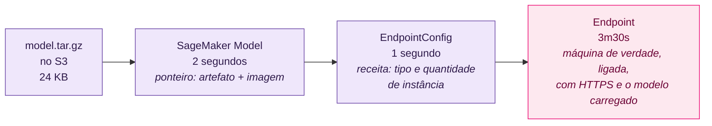

<details>
<summary><b>💡 Clique para entender: por que são TRÊS recursos e não um só</b></summary>
<blockquote>

Parece burocracia da AWS. É separação de responsabilidades, e cada camada existe para permitir uma operação real:

| Recurso | O que é | O que ele permite |
|---|---|---|
| **Model** | Um ponteiro: "este artefato no S3, executado com esta imagem de container" | Registrar várias versões do modelo sem subir máquina para nenhuma |
| **EndpointConfig** | Uma receita: qual tipo de instância, quantas, e qual (ou quais) modelos atendem, com que fatia de tráfego | Preparar uma configuração nova, com a versão nova do modelo, **antes** de mexer no que está em produção |
| **Endpoint** | A máquina ligada, com HTTPS e o modelo carregado em memória | Atender chamada de outro sistema |

O ganho aparece no dia da atualização. Para trocar o modelo em produção sem downtime, você cria um Model novo (2 segundos), uma EndpointConfig nova apontando para ele (1 segundo) e pede ao Endpoint existente para adotar a nova configuração. A AWS faz a transição gradual. Se o Model e o Endpoint fossem a mesma coisa, cada atualização exigiria derrubar o serviço.

Os 3m30s do Endpoint são o único item da lista que envolve provisionar hardware, baixar imagem de container e carregar o modelo em memória. Os 3 segundos dos outros dois são escrita de metadados.

</blockquote>
</details>

---

<a id="passo-15"></a>

**15. Leia as saídas do Terraform**

Ao fim do `make apply`, o Terraform imprime as saídas. Elas são o inventário do que existe agora na sua conta:

```text
Outputs:

account_id = "123456789012"
bucket_name = "prb-cloud-ml-lab1-123456789012"
deploy_serving = true
endpoint_config_name = "prb-cloud-ml-lab1-epc-a1b2c3d4"
endpoint_name = "prb-cloud-ml-lab1-ep-a1b2c3d4"
execution_role_arn = "arn:aws:iam::123456789012:role/LabRole"
hyperparameters = tomap({
  "colsample_bytree" = "0.90"
  "eta" = "0.10"
  "eval_metric" = "auc"
  "max_depth" = "4"
  "num_round" = "50"
  "objective" = "binary:logistic"
  "subsample" = "0.90"
  "verbosity" = "1"
})
instance_type = "ml.m5.large"
model_artifact_uri = "s3://prb-cloud-ml-lab1-123456789012/output/training/prb-cloud-ml-lab1-train-a1b2c3d4/output/model.tar.gz"
model_name = "prb-cloud-ml-lab1-model-a1b2c3d4"
region = "us-east-1"
training_channels = {
  "train" = "s3://prb-cloud-ml-lab1-123456789012/input/train/"
  "validation" = "s3://prb-cloud-ml-lab1-123456789012/input/validation/"
}
training_image = "683313688378.dkr.ecr.us-east-1.amazonaws.com/sagemaker-xgboost:1.7-1"
training_job_name = "prb-cloud-ml-lab1-train-a1b2c3d4"
training_output_uri = "s3://prb-cloud-ml-lab1-123456789012/output/training/"
```

> 📸 **Print 09 — `img/09-terraform-outputs.png`**
> Capture o bloco `Outputs:` inteiro, com `deploy_serving = true`, `endpoint_name`, `model_artifact_uri` e os hiperparâmetros visíveis. Prova o inventário do sistema e serve de referência para o aluno voltar depois, quando precisar do nome do endpoint.

<!-- 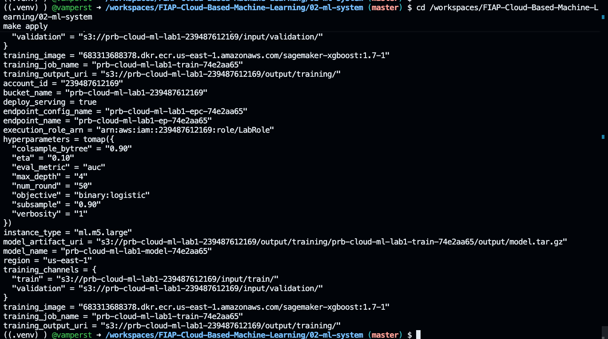 -->

Três observações sobre o que **não** está aqui:

1. **Nenhuma credencial.** As saídas trazem só identificadores. A chave temporária do Academy não aparece na saída, não vai para o estado do Terraform e não entra em log.
2. **O sufixo `a1b2c3d4` é do seu ciclo.** Ele é gerado aleatoriamente a cada `apply` do zero, então o seu vai ser outro. É o que permite recriar o laboratório sem colidir com nomes de um ciclo anterior.
3. **Os hiperparâmetros estão registrados.** `max_depth = 4`, `num_round = 50`, `eta = 0.10`. Se alguém perguntar em três meses "como esse modelo foi treinado", a resposta está versionada em código, não na memória de quem rodou.

---

<a id="passo-16"></a>

**16. Confirme o training job no console da AWS**

Vale ver com os próprios olhos que o que você criou por código está no console. Na aba do AWS Academy, clique em `AWS` (botão que abre o console) e navegue para **Amazon SageMaker AI** → menu lateral `Training` → `Training jobs`.

Você deve ver um job com o nome que apareceu na saída (`prb-cloud-ml-lab1-train-...`), com `Status: Completed`. Clique nele e observe duas seções:

- **Monitor**, com o tempo de execução e as métricas `train:auc` e `validation:auc` — os mesmos números do Passo 13.
- **Output**, com o caminho S3 do `model.tar.gz`.

> 📸 **Print 10 — `img/10-console-training-job.png`**
> Capture a página de detalhe do training job, mostrando `Status: Completed` e a seção com as métricas. Prova que o recurso criado por Terraform é o mesmo que o console mostra, e conecta a linha de log ao objeto real na AWS.

<!-- 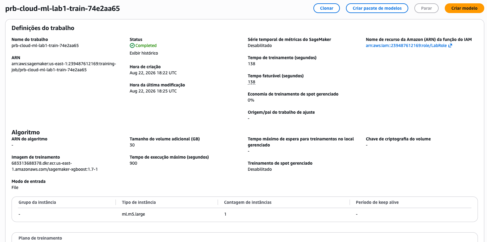 -->

<details>
<summary><b>⚠ Se der erro: <code>AccessDenied</code> ou a página do SageMaker não abre no Learner Lab</b></summary>
<blockquote>

O AWS Academy limita o que a interface do console permite. Se essa tela não abrir, o passo continua válido pela linha de comando, que consulta exatamente a mesma API que o console consultaria:

```bash
cd /workspaces/FIAP-Cloud-Based-Machine-Learning/02-ml-system
JOB=$(terraform -chdir=terraform output -raw training_job_name)
aws sagemaker describe-training-job --training-job-name "$JOB" \
  --query '{status:TrainingJobStatus,seconds:BillableTimeInSeconds,metrics:FinalMetricDataList[].{name:MetricName,value:Value},artifact:ModelArtifacts.S3ModelArtifacts}'
```

Nesse caso, capture o Print 10 a partir da saída deste comando no terminal.

</blockquote>
</details>

---

<a id="passo-17"></a>

**17. Confirme o endpoint e o bucket**

No console do SageMaker, vá em `Inference` → `Endpoints`. O endpoint deve estar com `Status: InService`.

> 📸 **Print 11 — `img/11-console-endpoint-inservice.png`**
> Capture a lista (ou o detalhe) do endpoint com `Status: InService` e o tipo de instância `ml.m5.large` visível. Prova que existe um serviço vivo, e é a imagem que ancora a conversa de custo: a partir deste estado, a conta é cobrada por hora.

<!-- 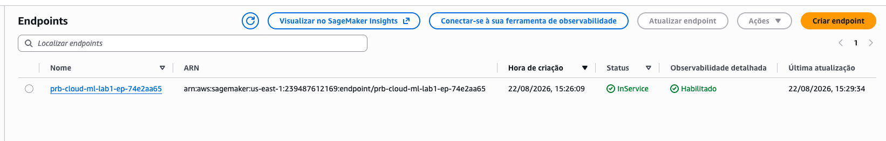 -->

Agora olhe a organização do bucket, que conta a história do fluxo de dados:

```bash
cd /workspaces/FIAP-Cloud-Based-Machine-Learning/02-ml-system
BUCKET=$(terraform -chdir=terraform output -raw bucket_name)
aws s3 ls "s3://$BUCKET" --recursive --human-readable
```

Saída esperada (o sufixo do job é o seu):

```text
input/train/train.csv
input/validation/validation.csv
metadata/dataset_manifest.json
metadata/schema.json
output/training/prb-cloud-ml-lab1-train-a1b2c3d4/output/model.tar.gz
```

> 📸 **Print 12 — `img/12-bucket-layout.png`**
> Capture esta listagem, com os três prefixos (`input/`, `metadata/`, `output/`) visíveis e o `model.tar.gz` no fim. Prova que a entrada, os metadados e a saída do treino são separados, e mostra o artefato como objeto real no armazenamento.

<!-- 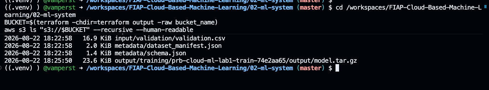 -->

Três prefixos, três papéis: `input/` é o que o treino leu, `metadata/` é o que descreve o dataset (manifesto com as impressões digitais e o esquema), e `output/` é o que o treino produziu. O `model.tar.gz` que está ali é o **mesmo** objeto que o endpoint carregou em memória no Passo 14.

### Checkpoint

- [x] `Apply complete! Resources: 9 added` no estágio 1.
- [x] O portão respondeu `Completed in 140s billable` e verificou o artefato com `HeadObject`.
- [x] `Apply complete! Resources: 3 added` no estágio 2.
- [x] `endpoint_name` aparece nas saídas do Terraform e o endpoint está `InService`.
- [x] O `model.tar.gz` aparece na listagem do bucket.

**A partir daqui existe um recurso cobrando por hora na sua conta.** Se precisar interromper a aula, pule para a [Parte 6](#parte-6---encerramento-e-limpeza) e rode `make destroy`.

---
## Parte 4 - Chamando o modelo e medindo o que ele vale

### Resultado esperado desta parte

Duas chamadas de fumaça com probabilidade coerente, os 600 clientes do conjunto de teste pontuados pelo endpoint, e um relatório de avaliação que aprova ou reprova o modelo contra critérios definidos **antes** de olhar o resultado.

<a id="passo-18"></a>

**18. Faça a primeira chamada real ao modelo**

```bash
cd /workspaces/FIAP-Cloud-Based-Machine-Learning/02-ml-system
make predict
```

Saída esperada, com os números iguais aos seus:

```text
[predict] endpoint prb-cloud-ml-lab1-ep-a1b2c3d4 (InService)
[predict] feature order: tenure_months, monthly_charges, support_calls_90d, payment_delay_days, usage_score, annual_contract, premium_plan
[predict] request high_risk: 2,220.00,6,30.00,15.00,0,0
[predict] request low_risk: 66,45.00,0,0.00,92.00,1,1
[predict] response high_risk: p(churn)=0.964739
[predict] response low_risk: p(churn)=0.017099
  [PASS] all_finite
  [PASS] all_in_unit_interval
  [PASS] one_probability_per_row
  [PASS] high_risk_scored_above_low_risk
[PASS] smoke inference
```

> 📸 **Print 13 — `img/13-make-predict.png`**
> Capture a saída inteira, com as duas requisições, as duas probabilidades (`0.964739` e `0.017099`) e as quatro verificações em `[PASS]`. Prova que existe um serviço respondendo a chamada e que a resposta é uma probabilidade, não um rótulo.

<!-- 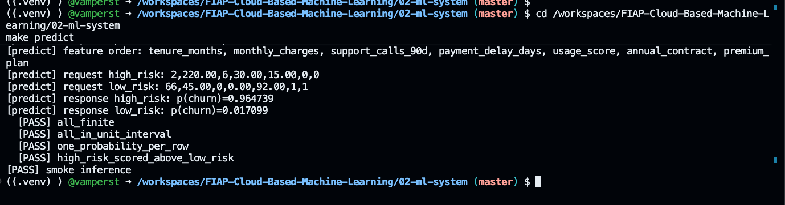 -->

**Este é o momento em que a pergunta da Helena passa a ter resposta.** Ela perguntou "dado um cliente, qual é a probabilidade de ele cancelar?". A resposta é `0.964739`, entregue por um endpoint HTTPS que qualquer sistema autorizado pode chamar.

Leia as duas requisições com atenção, porque elas são o conteúdo desta parte:

| Cliente | `tenure` | `charges` | `calls` | `delay` | `usage` | `anual` | `premium` | p(churn) |
|---|---|---|---|---|---|---|---|---|
| `high_risk` | 2 meses | 220,00 | 6 | 30,0 dias | 15,0 | 0 | 0 | **0,9647** |
| `low_risk` | 66 meses | 45,00 | 0 | 0,0 dias | 92,0 | 1 | 1 | **0,0171** |

O primeiro é cliente novo, com mensalidade alta, seis chamados de suporte, um mês de atraso no pagamento, uso baixíssimo e sem nenhuma amarra contratual. O segundo é cliente de cinco anos e meio, mensalidade baixa, nenhum chamado, nenhum atraso, uso alto, contrato anual e plano premium. O modelo separa os dois por quase 95 pontos percentuais, e a verificação `high_risk_scored_above_low_risk` existe exatamente para garantir que essa ordenação nunca se inverta silenciosamente.

<details>
<summary><b>💡 Clique para entender: por que a resposta é 0.9647 e não "vai cancelar"</b></summary>
<blockquote>

O modelo devolve uma **probabilidade**, e a decisão de negócio é uma etapa separada. Essa separação é o que dá flexibilidade ao sistema:

- Se a retenção tem orçamento para ligar para 500 clientes por mês, você ordena a base por probabilidade e liga para os 500 primeiros. Nenhum limiar é necessário.
- Se o time quer um alerta automático, você escolhe um limiar. E a escolha do limiar é uma decisão de custo, não de estatística: com 0,5, o modelo deste laboratório encontra 56% dos clientes que vão cancelar (recall) e acerta 67% dos que aponta (precisão). Baixando para 0,3, você encontra mais gente e erra mais também. A pergunta certa é "quanto custa uma ligação desnecessária contra quanto custa perder um cliente?".

Quem transforma probabilidade em rótulo dentro do modelo joga fora essa flexibilidade, e obriga a retreinar o modelo para mudar uma decisão que é de negócio.

Note também que este laboratório usa limiar fixo em `0.5`, e o relatório de avaliação diz isso explicitamente: *"fixed for teaching purposes, not a production choice"*.

</blockquote>
</details>

<details>
<summary><b>⚠ Se der erro: <code>ValidationError</code> ou <code>ModelError</code> na chamada</b></summary>
<blockquote>

Praticamente sempre é formato de payload. As duas causas:

1. **Número de colunas errado.** O endpoint espera exatamente 7 valores, sem cabeçalho e sem rótulo. Reveja o Passo 8.
2. **Endpoint não está `InService`.** Confirme:

```bash
cd /workspaces/FIAP-Cloud-Based-Machine-Learning/02-ml-system
EP=$(terraform -chdir=terraform output -raw endpoint_name)
aws sagemaker describe-endpoint --endpoint-name "$EP" --query EndpointStatus --output text
```

Se responder `Creating`, aguarde e tente de novo. Se responder `Failed`, rode `make destroy && make apply`.

</blockquote>
</details>

---

<a id="passo-19"></a>

**19. Pontue os 600 clientes que o modelo nunca viu**

Duas chamadas provam que o serviço responde. Elas não dizem se ele responde **bem**. Para isso existe o conjunto de teste, que ficou guardado desde o Passo 7 e nunca chegou perto do treino:

```bash
cd /workspaces/FIAP-Cloud-Based-Machine-Learning/02-ml-system
make evaluate
```

Saída esperada:

```text
[evaluate] scoring 600 held-out rows through prb-cloud-ml-lab1-ep-a1b2c3d4
[evaluate] batch 1: 250/600 rows scored
[evaluate] batch 2: 500/600 rows scored
[evaluate] batch 3: 600/600 rows scored
[evaluate] majority baseline accuracy 0.6633
[evaluate] accuracy 0.7617 (lift +0.0983)
[evaluate] precision 0.6746 recall 0.5644 f1 0.6146
[evaluate] roc_auc 0.8142 pr_auc 0.6994
  [PASS] roc_auc_min: 0.81417 vs 0.75
  [PASS] f1_min: 0.614555 vs 0.5
  [PASS] beats_majority_accuracy: 0.761667 vs 0.663333
  [PASS] metrics agree with scikit-learn
[evaluate] wrote .../artifacts/evidence/evaluation.json and evaluation.md
```

> 📸 **Print 14 — `img/14-make-evaluate.png`**
> Capture a saída inteira, com os três lotes, as métricas e os quatro `[PASS]`. Prova que o modelo foi avaliado em dados que nunca viu, que ele bate o baseline e que as métricas do laboratório conferem com o scikit-learn.

<!-- 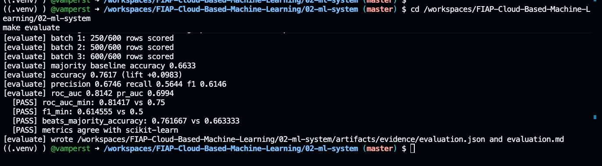 -->

**Compare com um colega.** Todos os números aqui precisam ser idênticos aos dele, até a quarta casa decimal. É a semente fixa do dataset trabalhando: se `accuracy 0.7617` divergir, algo divergiu antes.

Repare em `batch 1/2/3`: as 600 linhas não vão em uma chamada só, e sim em lotes de até 250. Isso não é limitação do laboratório, é como se conversa com um endpoint de tempo real — cada requisição tem limite de tamanho, e enviar de uma vez seria pedir para receber um erro de payload.

<details>
<summary><b>💡 Clique para entender: <code>metrics agree with scikit-learn</code>, e por que isso importa</b></summary>
<blockquote>

O laboratório calcula todas as métricas com implementação própria e, em seguida, calcula as mesmas métricas com o scikit-learn e compara. A diferença máxima observada é de `4.36e-07`, que é ruído de ponto flutuante.

Isso existe para eliminar uma classe inteira de erro silencioso. Métrica calculada errada não levanta exceção: ela devolve um número plausível. Um ROC-AUC implementado com o sinal invertido devolve 0,18 em vez de 0,82, e você conclui que o modelo é ruim quando ele é bom. Uma precisão que confunde falso positivo com falso negativo devolve um valor no intervalo certo, e ninguém percebe.

Duas implementações independentes concordando na sétima casa decimal é evidência de que o número que embasa a decisão está certo.

</blockquote>
</details>

---

<a id="passo-20"></a>

**20. Leia o relatório de avaliação**

```bash
cd /workspaces/FIAP-Cloud-Based-Machine-Learning/02-ml-system
code artifacts/evidence/evaluation.md
```

O arquivo abre no editor do Codespaces. Ele tem seis seções, e vale ler cada uma:

**Por que acurácia sozinha não responde**

| Preditor | Acurácia |
|---|---|
| Chutar sempre a classe majoritária ("ninguém cancela") | 0,6633 |
| Modelo em produção | 0,7617 |

Ganho sobre o baseline: **+0,0983**.

Este é o conteúdo mais importante de toda a Parte 4. Um preditor que responde "ninguém cancela" para todo cliente, sem olhar nenhuma característica, acerta **66% das vezes**. Ele acerta porque dois terços da base realmente não cancelam. E ele é completamente inútil, porque nunca aponta um cliente para a retenção ligar.

Se você contasse apenas "o modelo tem 76% de acurácia", a frase soaria boa e esconderia que o ganho real sobre chutar é de 10 pontos. É por isso que o critério de aceitação do laboratório inclui `must_beat_majority_accuracy`: o modelo é obrigado a provar que faz mais do que refletir a distribuição da base.

**Matriz de confusão**

|  | Previsto 0 | Previsto 1 |
|---|---|---|
| **Real 0** | 343 | 55 |
| **Real 1** | 88 | 114 |

Traduzindo para a linguagem da Helena, com limiar em 0,5:

- **114 clientes** que iam cancelar e o modelo apontou. São as oportunidades de retenção.
- **88 clientes** que iam cancelar e o modelo deixou passar. São a receita que continua vazando.
- **55 clientes** que o modelo apontou e que não iam cancelar. São ligações e descontos desperdiçados.
- **343 clientes** corretamente deixados em paz.

Os 88 e os 55 são o custo do sistema, e são a razão de existir a conversa sobre limiar. Nenhum ajuste de modelo faz os dois números irem a zero ao mesmo tempo.

**Métricas**

| Métrica | Valor |
|---|---|
| Acurácia | 0,7617 |
| Precisão | 0,6746 |
| Recall | 0,5644 |
| F1 | 0,6146 |
| ROC-AUC | 0,8142 |
| PR-AUC | 0,6994 |
| Brier score | 0,1627 |

**Calibração** (diagnóstico)

| Faixa de score | Linhas | Média prevista | Taxa observada |
|---|---|---|---|
| [0,0 – 0,2) | 215 | 0,1109 | 0,1023 |
| [0,2 – 0,4) | 164 | 0,2860 | 0,2805 |
| [0,4 – 0,6) | 103 | 0,4964 | 0,4854 |
| [0,6 – 0,8) | 76 | 0,6905 | 0,6053 |
| [0,8 – 1,0] | 42 | 0,8545 | 0,9048 |

Compare as duas últimas colunas linha por linha. Nas três primeiras faixas elas quase coincidem: quando o modelo diz "28%", cancelam 28%. Nas duas últimas faixas a diferença cresce, e em direções opostas — e são justamente as faixas com menos linhas (76 e 42), onde a estimativa é mais instável.

Calibração é o que permite usar a probabilidade como número, e não só como ordenação. Se o modelo diz 0,70 e cancelam 0,60, você pode multiplicar a probabilidade pelo valor do contrato e obter uma expectativa de receita em risco que faz sentido. Sem calibração, o número serve para ranquear e nada mais.

**Aceitação**

| Critério | Limiar | Observado | Resultado |
|---|---|---|---|
| `roc_auc_min` | 0,75 | 0,81417 | PASS |
| `f1_min` | 0,5 | 0,614555 | PASS |
| `beats_majority_accuracy` | 0,663333 | 0,761667 | PASS |

**Geral: PASS**

> 📸 **Print 15 — `img/15-evaluation-md.png`**
> Capture o `evaluation.md` aberto no editor, mostrando a tabela de baseline e a tabela de aceitação com `Overall: PASS`. Prova que os critérios de aprovação estavam definidos em configuração antes do resultado, e que o veredito é uma consequência deles.

<!--  -->

Os três limiares vivem em `config/lab.yaml` e foram escritos **antes** de qualquer treino. Isso é o oposto do que costuma acontecer: treinar, ver que deu 0,81, e então declarar que 0,80 era a meta. Critério definido depois do resultado não é critério, é justificativa.

---

<a id="passo-21"></a>

**21. Responda três perguntas antes de seguir**

Pare aqui e responda, olhando o seu `evaluation.md`. Não é retórica: as três respostas aparecem em prova e em reunião.

<dl>
  <dt><b>R1. O modelo de vocês é bom o suficiente para a Helena investir em retenção?</b></dt>
  <dd>
    Não existe resposta única. Ele encontra 114 dos 202 clientes que iam cancelar, e desperdiça esforço em 55. A resposta depende do valor de um cliente retido contra o custo de uma abordagem desnecessária. O que o laboratório garante é que você tem os números para fazer essa conta, em vez de opinar.
  </dd>
  <dt><b>R2. Se a Helena pedir "não quero perder nenhum cliente que ia cancelar", o que muda?</b></dt>
  <dd>
    Ela está pedindo recall alto, e o caminho é baixar o limiar de 0,5. O recall sobe, e a precisão cai: mais gente apontada corretamente, e mais gente apontada à toa. Como o endpoint devolve probabilidade, isso se resolve mudando um número na sua aplicação, sem retreinar nada e sem tocar na infraestrutura.
  </dd>
  <dt><b>R3. Por que a acurácia de 0,7617 seria uma resposta desonesta se apresentada sozinha?</b></dt>
  <dd>
    Porque chutar "ninguém cancela" entrega 0,6633 sem nenhum modelo. Apresentar 76% sem apresentar o baseline sugere um ganho quatro vezes maior do que o real, e omite que o valor do sistema está na capacidade de <i>apontar</i> quem vai cancelar — coisa que a acurácia não mede.
  </dd>
</dl>

### Checkpoint

- [x] `make predict` termina com `[PASS] smoke inference`, com `0.964739` e `0.017099`.
- [x] `make evaluate` termina com os três critérios em `PASS` e a concordância com o scikit-learn.
- [x] Você abriu o `evaluation.md` e comparou o modelo com o baseline majoritário.
- [x] Você respondeu R1, R2 e R3.

---
## Parte 5 - O dossiê e a decisão

### Resultado esperado desta parte

Um arquivo `evidence.md` que prova, elo por elo, que a cadeia de capacidades está completa, e um `DECISION.md` escrito por você recomendando ou não o uso do modelo.

<a id="passo-22"></a>

**22. Gere o pacote de evidência**

```bash
cd /workspaces/FIAP-Cloud-Based-Machine-Learning/02-ml-system
make evidence
```

Saída esperada:

```text
  [PASS] storage: dataset generated and fingerprinted
  [PASS] storage: training channels proven in S3
  [PASS] training: job reached Completed
  [PASS] artifact: model.tar.gz proven in S3
  [PASS] serving: endpoint InService
  [PASS] serving: deterministic smoke inference passed
  [PASS] evidence: test-set metrics meet acceptance
[PASS] evidence chain -> .../artifacts/evidence/evidence.md
```

Sete elos, sete verificações. Nenhuma delas lê um log ou confia em memória: cada uma consulta a AWS ou recalcula o valor.

> 📸 **Print 16 — `img/16-make-evidence.png`**
> Capture as oito linhas, com os sete `[PASS]` e o caminho do `evidence.md`. Prova que a cadeia inteira, do armazenamento à evidência, foi verificada de forma independente e no mesmo ciclo.

<!-- 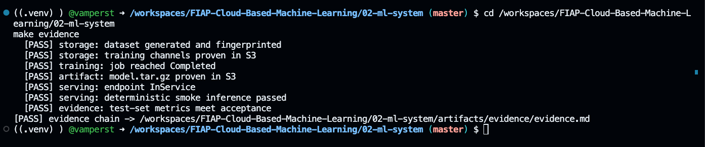 -->

---

<a id="passo-23"></a>

**23. Leia o dossiê**

```bash
cd /workspaces/FIAP-Cloud-Based-Machine-Learning/02-ml-system
code artifacts/evidence/evidence.md
```

O arquivo começa com uma frase que resume o laboratório:

> A model is not an ML system. Below is the chain that turns one into the other, each link recorded with something checkable.

São sete seções, e cada uma corresponde a um elo da cadeia. Alguns valores que vale localizar no **seu** arquivo:

| Onde | O que localizar | Valor esperado |
|---|---|---|
| 1. Environment | `Git commit` | o commit exato do código que produziu tudo isso |
| 2. Data | SHA-256 de `source.csv` | começa com `c2a8b771` |
| 2. Data | `Matches local file` nos dois canais | `True` nos dois |
| 3. Training | `Billable seconds` | `140` |
| 3. Training | `validation:auc` | `0.819570004940033` |
| 4. Model artifact | `Size (bytes)` e `ETag` | `24208` e `7cc377ee31c04eaec5b3dcad2ff8b1b5` |
| 4. Model artifact | `Existence proven by` | `s3:HeadObject before the Model was created` |
| 5. Serving | `Endpoint status` | `InService` |
| 6. Evaluation | `Beats baseline` | `True` |
| 7. Verdict | `Chain complete` | `yes` |

<details>
<summary><b>💡 Clique para entender: por que um dossiê e não um print de tela</b></summary>
<blockquote>

Suponha que, três meses depois de o sistema entrar no ar, a Helena questione uma decisão que custou dinheiro. A pergunta que ela vai fazer é alguma variação de: *"que modelo respondeu isso, treinado com quais dados, e quem validou?"*.

Sem dossiê, a resposta é reconstruída de memória e de arquivos espalhados. Com este arquivo, cada pergunta tem endereço:

| Pergunta | Onde está a resposta |
|---|---|
| Qual código gerou isso? | `Git commit`, seção 1 |
| Quais dados exatamente? | SHA-256 de cada arquivo, seção 2 |
| Os dados que subiram são os mesmos que eu tinha localmente? | `Matches local file`, seção 2 |
| Como o modelo foi treinado? | Hiperparâmetros e imagem, seção 3 |
| Qual artefato está atendendo? | URI e ETag, seção 4 |
| Quanto ele vale? | Métricas e matriz de confusão, seção 6 |
| Alguém verificou? | Sete linhas de veredito, seção 7 |

Repare no `Existence proven by: s3:HeadObject before the Model was created`. Essa linha diz que a verificação aconteceu **antes** da criação do recurso que depende dela — ou seja, a ordem correta, e não uma conferência retroativa feita depois de tudo dar certo.

Isso é rastreabilidade, e ela vale mais do que qualquer casa decimal a mais no ROC-AUC.

</blockquote>
</details>

<details>
<summary><b>⚠ Se aparecer <code>Working tree clean: False</code> no seu dossiê</b></summary>
<blockquote>

Significa apenas que você tem alterações locais não commitadas no repositório — o que é normal em laboratório de aula. Em ambiente real, essa linha deveria estar em `True` antes de qualquer coisa ir para produção, porque um dossiê que aponta para um commit mas foi gerado com código modificado não prova o que diz provar.

</blockquote>
</details>

---

<a id="passo-24"></a>

**24. Escreva a sua recomendação**

Este é o entregável em que você deixa de ser executor de comandos. Crie o arquivo:

```bash
cd /workspaces/FIAP-Cloud-Based-Machine-Learning/02-ml-system
code DECISION.md
```

Escreva de 8 a 15 linhas, endereçadas à Helena, e não ao professor. Estrutura sugerida:

<dl>
  <dt><b>Recomendação</b></dt>
  <dd>Usar ou não usar este modelo para priorizar a fila de retenção. Uma frase, sem hedge.</dd>
  <dt><b>Evidência</b></dt>
  <dd>Os dois ou três números que sustentam a recomendação, cada um com o que ele significa. Um deles precisa ser a comparação com o baseline majoritário.</dd>
  <dt><b>Custo do erro</b></dt>
  <dd>Quantos clientes o modelo deixa passar e quantas abordagens desnecessárias ele gera, nos números da sua matriz de confusão.</dd>
  <dt><b>Limitações</b></dt>
  <dd>Ao menos duas honestas. Sugestões de partida: os dados são sintéticos; a calibração se degrada nas faixas altas de score; o limiar de 0,5 é arbitrário; não há monitoramento de desvio de distribuição; um único endpoint sem redundância.</dd>
  <dt><b>Condições</b></dt>
  <dd>O que precisaria existir antes de isso valer para 180 mil assinantes de verdade.</dd>
</dl>

> [!TIP]
> A parte mais valiosa do exercício é a seção de limitações. Recomendação sem limitação declarada não é análise, é venda — e quem assina uma recomendação assim é quem responde quando ela falha.

### Checkpoint

- [x] `make evidence` responde com os sete `[PASS]`.
- [x] `evidence.md` mostra `Chain complete: yes`.
- [x] `DECISION.md` existe, com recomendação, evidência, custo do erro, limitações e condições.

---

## Parte 6 - Encerramento e limpeza

### Resultado esperado desta parte

Zero recursos cobrando na sua conta, provado por comando e não por confiança.

> [!CAUTION]
> **Esta parte não é opcional.** O endpoint continua cobrando por hora enquanto existir, inclusive com o Codespaces desligado, inclusive com o navegador fechado, inclusive de madrugada. O crédito do Learner Lab é de US$ 50 e não é reposto.

<a id="passo-25"></a>

**25. Destrua tudo**

```bash
cd /workspaces/FIAP-Cloud-Based-Machine-Learning/02-ml-system
make destroy
```

Leva de 2 a 4 minutos, e a maior parte é o endpoint sendo desligado. Saída esperada no fim:

```text
Destroy complete! Resources: 12 destroyed.
```

Doze recursos: os nove do estágio 1 mais os três do estágio 2. O Terraform destrói na ordem inversa da criação, então o endpoint sai antes do bucket.

> 📸 **Print 17 — `img/17-make-destroy.png`**
> Capture a linha `Destroy complete! Resources: 12 destroyed.`. Prova que os doze recursos criados foram removidos no mesmo ciclo.

<!-- 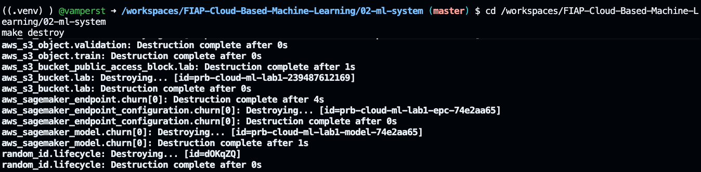 -->

<details>
<summary><b>⚠ Se der erro: o destroy falha porque o bucket não está vazio</b></summary>
<blockquote>

Acontece quando algo escreveu no bucket fora do Terraform — por exemplo, um segundo training job. Esvazie e rode de novo:

```bash
cd /workspaces/FIAP-Cloud-Based-Machine-Learning/02-ml-system
BUCKET=$(terraform -chdir=terraform output -raw bucket_name)
aws s3 rm "s3://$BUCKET" --recursive
make destroy
```

</blockquote>
</details>

<details>
<summary><b>⚠ Se der erro: <code>ExpiredToken</code> durante o destroy</b></summary>
<blockquote>

**Este é o cenário mais perigoso do laboratório**, porque a credencial vencer no meio do destroy deixa o endpoint no ar cobrando. Renove a credencial (Passo 3) e rode `make destroy` de novo imediatamente. Depois, confirme com o Passo 26 — não presuma.

</blockquote>
</details>

---

<a id="passo-26"></a>

**26. Prove que não sobrou nada cobrando**

`Destroy complete` é o Terraform contando o que **ele** acha que fez. A verificação independente é outra coisa:

```bash
cd /workspaces/FIAP-Cloud-Based-Machine-Learning/02-ml-system
make verify-clean
```

Saída esperada:

```text
  [PASS] no endpoints for this lab
  [PASS] no endpoint configs for this lab
  [PASS] no models for this lab
  [PASS] no lab bucket
[PASS] verify-clean
```

> 📸 **Print 18 — `img/18-verify-clean.png`**
> Capture as cinco linhas, com os quatro `[PASS]` e o `[PASS] verify-clean`. Prova, consultando a AWS diretamente, que nenhum recurso cobrável do laboratório sobrou. É o print que fecha o ciclo de custo.

<!-- 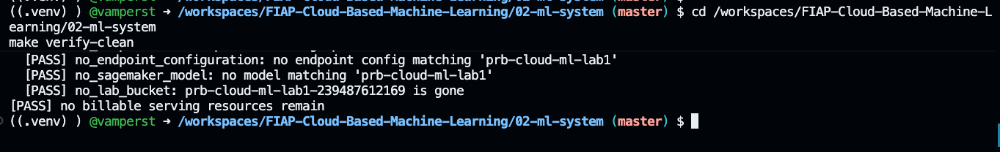 -->

<details>
<summary><b>💡 Clique para entender: por que verificar depois de destruir</b></summary>
<blockquote>

O `destroy` do Terraform só remove o que está no **estado dele**. Ele é cego para qualquer coisa criada por fora: um endpoint que você subiu pelo console para testar, um recurso que sobrou de um `apply` interrompido antes de registrar o estado, um bucket de um ciclo anterior cujo estado foi perdido quando o Codespaces foi recriado.

O `verify-clean` não olha o estado. Ele pergunta à AWS: existe algum endpoint, endpoint config, modelo ou bucket com o prefixo deste laboratório? Quatro perguntas independentes, quatro respostas negativas.

A diferença entre "eu destruí" e "eu verifiquei que não existe" é a diferença entre uma conta de US$ 0 e uma surpresa no fim do mês.

</blockquote>
</details>

---

<a id="passo-27"></a>

**27. Limpe os arquivos locais (opcional)**

```bash
cd /workspaces/FIAP-Cloud-Based-Machine-Learning/02-ml-system
make clean
```

Remove `artifacts/` e os caches do Python. **Nunca toca na AWS.** Só rode se você já guardou os prints e o `DECISION.md`. Melhor ainda: deixe para depois de commitar o seu trabalho no seu fork.

---

<a id="passo-28"></a>

**28. Desligue o Codespaces**

O Codespaces também consome cota (de horas do GitHub, não do crédito AWS). Na aba do repositório: `Code` → `Codespaces` → três pontos ao lado do seu Codespace → `Stop codespace`.

Ele preserva o disco, então você volta depois com tudo no lugar. A credencial da AWS, porém, terá vencido: reveja o Passo 3 ao retomar.

> [!CAUTION]
> **Pare, não apague.** Este é o Codespaces de toda a disciplina, inclusive do trabalho final. `Stop codespace` zera o consumo de horas e mantém o ambiente; `Delete` obrigaria você a repetir o Lab 01 do zero na próxima aula.

### Checkpoint

- [x] `Destroy complete! Resources: 12 destroyed.`
- [x] `make verify-clean` responde `[PASS] verify-clean` com os quatro itens.
- [x] Codespaces parado.

**Zero recursos cobrando.** O laboratório terminou com a conta no mesmo estado em que começou.

---

## Rodando o ciclo inteiro de novo

<a id="passo-29"></a>

**29. Repita tudo com um comando**

Agora que você executou cada etapa entendendo o que ela faz, vale ver o ciclo completo rodando de uma vez:

```bash
cd /workspaces/FIAP-Cloud-Based-Machine-Learning/02-ml-system
make e2e
```

Ele encadeia `doctor` → `apply` → `predict` → `evaluate` → `evidence` e, no fim, executa `destroy` e `verify-clean` **automaticamente**. Leva de 12 a 15 minutos.

O detalhe que importa: a limpeza roda com armadilha de saída (`trap`), ou seja, **ela acontece mesmo se um passo do meio falhar**. Um erro no `evaluate` não deixa endpoint órfão cobrando.

> [!CAUTION]
> Existe a variação `make e2e KEEP_RESOURCES=1`, que **não** destrói nada no fim, para quando você quer inspecionar o endpoint depois. Ela avisa em tela:
>
> ```text
> !! KEEP_RESOURCES=1: the endpoint will stay up and keep billing.
> !! Run 'make destroy' as soon as you are done, or the lab budget pays for it.
> ```
>
> Se você usar essa variação, `make destroy` é responsabilidade sua.

Este comando é a forma como o laboratório é validado antes de chegar até você: um ciclo completo, do zero à conta limpa, sem intervenção manual. Reprodutibilidade não é um bônus deste material, é a propriedade que ele foi construído para ter.

---

## Conclusão

Você começou com uma pergunta de negócio e terminou com um sistema que responde a ela.

Entre uma coisa e outra, cinco capacidades foram encadeadas, e cada elo foi verificado antes de o próximo existir: os dados passaram por 48 verificações antes de subir; o treino rodou por 140 segundos cobrados e produziu um artefato de 24 KB; a existência desse artefato foi provada com `HeadObject` **antes** de o modelo ser criado; o endpoint subiu em 3m30s e respondeu `0.964739` para o cliente de risco alto; e os 600 clientes que o modelo nunca viu mostraram um ganho de 10 pontos de acurácia sobre chutar a classe majoritária.

Três ideias sobrevivem ao laboratório:

<dl>
  <dt><b>Modelo é um arquivo; sistema é uma cadeia</b></dt>
  <dd>O <code>model.tar.gz</code> de 24 KB não serve a ninguém sozinho. O que atende a Helena é a cadeia inteira — armazenamento, treino, artefato, serving, evidência — e essa cadeia é feita de recursos que alguém precisa provisionar, versionar, medir e desligar.</dd>
  <dt><b>Computação finita e computação persistente têm economias opostas</b></dt>
  <dd>Treinar custou uma fração de centavo porque terminou sozinho. Servir custa por hora porque precisa estar de pé quando a chamada chegar. Todo projeto de ML na nuvem gasta a maior parte do dinheiro na segunda categoria, e é ali que a engenharia decide se o projeto é sustentável.</dd>
  <dt><b>Métrica sem baseline é afirmação sem contexto</b></dt>
  <dd>Setenta e seis por cento de acurácia parece bom até você lembrar que chutar entrega 66%. O baseline majoritário é a primeira pergunta a fazer diante de qualquer número de classificação, e a que mais desmonta apresentação otimista.</dd>
</dl>

## Próximo passo

O laboratório **03 - Serving e escala** continua desta arquitetura e ataca as perguntas que este endpoint único não responde: o que acontece quando chegam mil chamadas por segundo, como atualizar o modelo sem derrubar o serviço, e quando a resposta certa é processamento em lote em vez de endpoint ligado 24 horas por dia. Ele será liberado na pasta `03-serving-and-scaling`.

Enquanto isso, se quiser explorar por conta própria, três experimentos valem o tempo:

1. Mude `max_depth` de 4 para 8 em `terraform/variables.tf`, rode `make e2e` e compare a distância entre `train:auc` e `validation:auc`. Você deve ver o sobreajuste aumentando.
2. Baixe `decision_threshold` de 0,5 para 0,3 em `config/lab.yaml`, rode `make evaluate` com o endpoint no ar e observe recall subindo e precisão caindo na matriz de confusão.
3. Troque a semente em `config/lab.yaml`, rode `make data` e confirme que todos os hashes mudam, e que o contrato continua aprovando, porque o formato não mudou.

---

<details>
<summary><b>💡 Glossário rápido</b></summary>
<blockquote>

| Termo | O que é neste laboratório |
|---|---|
| **Training job** | Computação finita gerenciada pela AWS: sobe máquina, treina, escreve o artefato, se encerra e para de cobrar |
| **Artefato de modelo** | O `model.tar.gz` no S3. É o que o treino produz e o que o serving consome |
| **SageMaker Model** | Metadado que aponta para um artefato e para uma imagem de container. Não é máquina, não cobra |
| **EndpointConfig** | Receita de quanto hardware atende o modelo e com que divisão de tráfego. Não é máquina, não cobra |
| **Endpoint** | Máquina ligada com HTTPS e o modelo em memória. **Cobra por hora até ser destruído** |
| **Baseline majoritário** | Preditor que sempre responde a classe mais frequente. O adversário mínimo de qualquer classificador |
| **ROC-AUC** | Probabilidade de o modelo dar score maior a um cliente que cancelou do que a um que não cancelou. 0,5 é sorteio |
| **PR-AUC** | Área sob a curva precisão-recall. Mais informativa que ROC-AUC quando a classe de interesse é minoritária |
| **Brier score** | Erro quadrático médio das probabilidades. Quanto menor, melhor calibrado |
| **Calibração** | Grau em que "0,7 de probabilidade" corresponde a 70% de ocorrência real |
| **Limiar de decisão** | Ponto de corte que transforma probabilidade em ação. Decisão de negócio, não de modelo |
| **`LabRole`** | Role pré-existente do AWS Academy que o SageMaker assume para ler o S3 e escrever o artefato |
| **Contrato de dados** | Código executável que verifica formato, faixas, divisões e impressões digitais antes de qualquer custo |

</blockquote>
</details>

<details>
<summary><b>💡 Apêndice técnico: versões, estrutura e convenções</b></summary>
<blockquote>

**Versões fixadas**

| Componente | Versão |
|---|---|
| Terraform | 1.15.8 |
| `hashicorp/aws` | 6.60.0 |
| `hashicorp/random` | 3.9.0 |
| Python | 3.12 |
| Imagem de treino e inferência | `683313688378.dkr.ecr.us-east-1.amazonaws.com/sagemaker-xgboost:1.7-1` |
| Instância de treino e serving | `ml.m5.large` |
| Semente do dataset | 20260817 |

**Estrutura da pasta**

```text
02-ml-system/
├── Makefile                  # os 14 comandos do lab
├── config/lab.yaml           # única fonte de verdade: região, semente, schema, aceitação
├── requirements.txt          # dependências Python com versão exata
├── scripts/                  # um script por etapa, todos executáveis à mão
│   ├── setup.sh              #   instalação do lab dentro do Codespaces da disciplina
│   ├── check_aws.py          #   make doctor
│   ├── generate_dataset.py   #   make data
│   ├── validate_data.py      #   contrato de dados (48 verificações)
│   ├── wait_training.py      #   o portão entre os dois estágios
│   ├── predict.py            #   make predict
│   ├── evaluate_endpoint.py  #   make evaluate
│   ├── evidence.py           #   make evidence
│   └── verify_clean.py       #   make verify-clean
├── src/                      # biblioteca compartilhada pelos scripts
├── terraform/                # infraestrutura em dois estágios
└── artifacts/                # gerado, ignorado pelo git
    ├── data/                 #   dataset e manifesto
    └── evidence/             #   evaluation.md, evidence.md e os JSON
```

**Convenção de saída dos scripts**

Todo script deste laboratório escreve o **resultado** em `stdout` (JSON) e a **narração** em `stderr` (as linhas com `[PASS]`, `[data]`, `[eval]`). É por isso que o `Makefile` redireciona `stdout` para `/dev/null`: você vê o progresso, e o dado fica disponível para automação sem precisar interpretar log.

Na prática, isso significa que qualquer etapa pode ser capturada como dado:

```bash
cd /workspaces/FIAP-Cloud-Based-Machine-Learning/02-ml-system
PYTHONPATH=src .venv/bin/python scripts/evaluate_endpoint.py > metricas.json
```

**O que este laboratório nunca faz**

- Nunca imprime chave de acesso, segredo ou token de sessão, em nenhum canal.
- Nunca grava credencial em estado do Terraform, em saída ou em arquivo de evidência.
- Nunca cria recurso de IAM (o Academy não permite; a `LabRole` é pré-existente).
- Nunca cria recurso fora de `us-east-1`.
- Nunca deixa recurso cobrável sem um comando que prove a remoção.

</blockquote>
</details>

<details>
<summary><b>💡 Onde pedir ajuda</b></summary>
<blockquote>

1. Releia o bloco `⚠ Se der erro` do passo em que você travou. As falhas de laboratório se concentram em quatro causas: credencial vencida, região errada, configuração de container errada e formato de payload.
2. Rode `make doctor`. Ele é o diagnóstico mais rápido e cobre as duas primeiras causas.
3. Se travar em um passo com custo em aberto (endpoint no ar), rode `make destroy && make verify-clean` **antes** de pedir ajuda. O endpoint cobra enquanto você espera resposta.
4. Ao relatar, traga: o número do passo, o comando exato, a saída completa do erro e o resultado de `make doctor`. Nunca cole credencial.

</blockquote>
</details>
