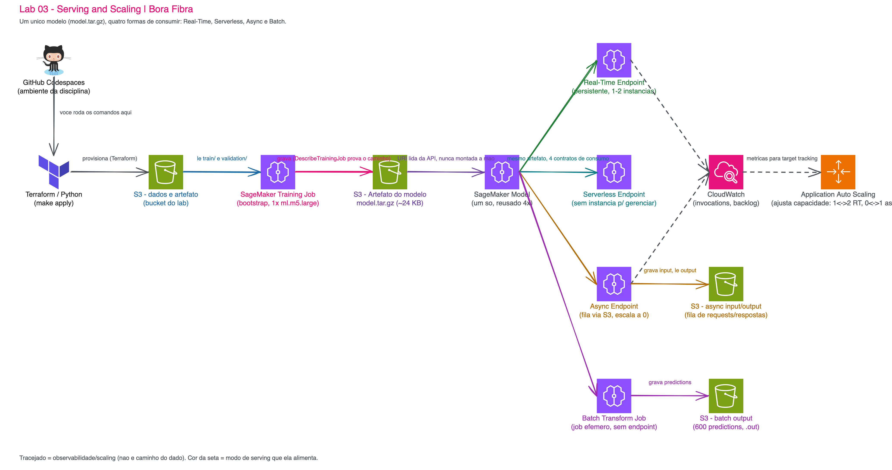

# 03 - Serving and Scaling

Antes de começar, o setup do ambiente é o [Lab 01 - Setup e configuração de ambiente](../01-create-codespaces/README.md). O [Lab 02 - Do modelo ao sistema de Machine Learning](../02-ml-system/README.md) é a referência conceitual deste laboratório (o mesmo padrão de dois estágios, o mesmo jeito de ler o artefato pela API), mas este lab **não depende de nenhum arquivo runtime do Lab 02**: ele gera o próprio treino do zero.

Todos os comandos rodam **no terminal do mesmo Codespaces** que você já usa desde o Lab 01. Não existe passo obrigatório de clicar no console da AWS.

> [!WARNING]
> **Pré-requisitos. Confira estes quatro itens antes de continuar:**
>
> - [ ] Lab 01 e Lab 02 concluídos (mesmo Codespaces, mesma conta AWS).
> - [ ] Sessão do AWS Academy Learner Lab **iniciada**.
> - [ ] Credenciais do Academy copiadas para `~/.aws/credentials`. Elas expiram a cada 4 horas.
> - [ ] Crédito disponível no Learner Lab (o risco real é esquecer o endpoint real-time ligado).
>
> **Tempo estimado: 75 a 95 minutos.**

No Lab 02 você entregou **um** jeito de servir o modelo: um endpoint sempre ligado. Aqui você aprende que "sempre ligado" é uma escolha, não a única opção, e a escolha certa depende do contrato do workload, não do modelo em si.

## Principais pontos de aprendizagem

- Por que não existe um padrão de serving universalmente melhor: o que muda é SLA, volume, concorrência, payload e tolerância a espera.
- A diferença entre computação **persistente** (real-time, async com capacidade > 0) e **sob demanda** (serverless, batch).
- Por que scaling automático e demonstração determinística de elasticidade são coisas diferentes.
- Por que o mesmo `model.tar.gz` pode sustentar quatro contratos de consumo sem ser copiado quatro vezes.
- A diferença entre latência (p50/p95/p99) e throughput (requests/segundo), e por que nenhuma das duas sozinha decide uma arquitetura.

## O que você terá ao final

Um único modelo servido por três endpoints simultâneos (real-time, serverless, async) mais um job de batch transform efêmero, com autoscaling real configurado e uma demonstração controlada de elasticidade 1→2→1 provada por API. Um dossiê em `artifacts/evidence/` documenta cada afirmação, e a conta termina limpa, comprovada por varredura de API.

### Arquitetura



Um único `model.tar.gz` sai do training job de bootstrap e alimenta quatro formas de consumo: o Real-Time Endpoint (instância sempre ligada), o Serverless Endpoint (capacidade gerenciada pela AWS), o Async Endpoint (fila via S3, pode ir a zero) e um Batch Transform Job (computação efêmora, sem endpoint). Application Auto Scaling e CloudWatch (linhas tracejadas) cuidam da elasticidade do Real-Time e do Async: são observabilidade, não o caminho do dado. Fonte editável em [`diagramas/arquitetura.excalidraw`](diagramas/arquitetura.excalidraw).

> [!TIP]
> Os blocos **💡 Clique para entender** são aprofundamentos opcionais. Os blocos **⚠ Se der erro** aparecem logo depois do passo que pode falhar.

## Mapa do lab

| Parte | O que você faz | Passos | Tempo |
|---|---|---|---|
| [Parte 1 - Ambiente e portão de entrada](#parte-1---ambiente-e-portão-de-entrada) | Reabre o Codespaces, instala o que é específico deste lab, roda o portão de entrada. | [1](#passo-1) · [2](#passo-2) · [3](#passo-3) · [4](#passo-4) · [5](#passo-5) | ~10 min |
| [Parte 2 - Um workload comum](#parte-2---um-workload-comum) | Gera o dataset e identifica os quatro contratos de workload. | [6](#passo-6) · [7](#passo-7) · [8](#passo-8) | ~10 min |
| [Parte 3 - Um modelo, três formas de serving](#parte-3---um-modelo-três-formas-de-serving) | Sobe o bootstrap de treino e os três endpoints com um único comando. | [9](#passo-9) · [10](#passo-10) · [11](#passo-11) · [12](#passo-12) | ~15 min |
| [Parte 4 - Síncrono persistente vs serverless](#parte-4---síncrono-persistente-vs-serverless) | Compara latência e comportamento entre real-time e serverless. | [13](#passo-13) · [14](#passo-14) | ~10 min |
| [Parte 5 - Quando esperar é parte do contrato](#parte-5---quando-esperar-é-parte-do-contrato) | Roda async e batch, compara os dois. | [15](#passo-15) · [16](#passo-16) · [17](#passo-17) · [18](#passo-18) | ~15 min |
| [Parte 6 - Concorrência e elasticidade](#parte-6---concorrência-e-elasticidade) | Load test e demonstração controlada de scaling 1→2→1. | [19](#passo-19) · [20](#passo-20) · [21](#passo-21) · [22](#passo-22) | ~15 min |
| [Parte 7 - Dossiê e decisão](#parte-7---dossiê-e-decisão) | Consolida a evidência e escreve a recomendação para Helena. | [23](#passo-23) · [24](#passo-24) | ~10 min |
| [Parte 8 - Encerramento obrigatório](#parte-8---encerramento-obrigatório) | Destrói tudo e prova por API que nada faturável sobrou. | [25](#passo-25) · [26](#passo-26) | ~10 min |

Travou em algum passo? Clique no número na tabela acima para pular direto para ele.

---

## Contexto

> Quinta-feira, 10h05. O endpoint demonstrado na aula anterior funciona. **Helena Marques, diretora de receita** da **Bora Fibra**, volta à sala com uma nova preocupação:
>
> > *"Agora eu consigo pedir o risco de churn de um cliente. Só que temos quatro situações diferentes: atendimento precisa de resposta na hora; o app recebe picos quando fecha a fatura; marketing quer pontuar a base toda de madrugada; e alguns arquivos grandes podem esperar. Eu não quero pagar infraestrutura 24 horas por dia para tudo. Como escolhemos o jeito certo de servir e como isso escala quando o tráfego muda?"*

Não existe serving universalmente melhor. O que muda é o **contrato do workload**: SLA, volume, concorrência, payload, tolerância a espera, frequência e custo de ociosidade.

### Pergunta-âncora do laboratório

> **Qual padrão de inferência atende este workload com o menor custo e complexidade sem violar o SLA que o negócio realmente precisa?**

Você vai responder essa pergunta em quatro marcos: antes do deploy (abstrata), depois de comparar real-time e serverless (evidência de latência/ociosidade), depois de async e batch (a dimensão fila/lote aparece), e depois do scaling (elasticidade e custo operacional entram na conta).

### Quatro workloads, quatro padrões

| Workload | SLA / comportamento | Padrão candidato | O que o lab prova |
|---|---|---|---|
| Atendimento humano | resposta síncrona, baixa latência, tráfego contínuo | Real-Time Endpoint | endpoint persistente e previsível |
| App após fechamento da fatura | rajadas curtas, longos períodos ociosos | Serverless Inference | paga pelo uso, tem comportamento de first-request |
| Importação de arquivo pesado | não bloqueia o cliente, aceita fila | Asynchronous Inference | request desacoplada via S3, pode escalar a zero |
| Campanha noturna | centenas/milhares de registros de uma vez | Batch Transform | computação efêmera, sem endpoint persistente |

### Por que esta arquitetura existe

| Problema de negócio | Responde bem | Responde mal | Quando acontece na vida real |
|---|---|---|---|
| Retenção precisa do risco durante a ligação | probabilidade **deste** cliente, agora, em milissegundos | pontuar os 180 mil clientes de uma vez (isso é lote, não endpoint) | atendimento, cobrança, antifraude |
| App consulta risco só depois do fechamento da fatura | paga só pelo uso, sem instância ociosa o resto do mês | tráfego constante e alta concorrência (cold behavior vira custo de UX) | picos previsíveis e esparsos |
| Um arquivo com 50 mil linhas chega para pontuar | desacopla o cliente da espera, processa quando dá | resposta que precisa ser síncrona | importação, processamento em segundo plano |
| Campanha pontua a base inteira à noite | computação efêmera, sem endpoint 24/7 | qualquer chamada individual síncrona | relatório periódico, score de carteira |

> [!CAUTION]
> **O único jeito de gastar de verdade neste laboratório é esquecer um endpoint ligado.**
>
> | Recurso | Quando cobra | Risco em aula |
> |---|---|---|
> | Training `ml.m5.large` | só durante o bootstrap | baixo, termina sozinho |
> | **Real-Time `ml.m5.large`** | **enquanto o endpoint existir** | **alto: é o vilão de ociosidade** |
> | Async `ml.m5.large` | enquanto capacidade > 0; pode ir a zero | médio |
> | Serverless | por invocação/duração | baixo quando ocioso |
> | Batch Transform `ml.m5.large` | só a duração do job | baixo, efêmero |
> | S3 | storage/request | desprezível neste volume |
>
> Ordem de grandeza: um `ml.m5.large` fica na casa de **US$ 0,1/h**; confira o [pricing atual do SageMaker](https://aws.amazon.com/sagemaker/pricing/). O Passo 25 destrói tudo, e o Passo 26 prova que foi destruído.

<details>
<summary><b>💡 Clique para entender: por que scaling automático e "prova de elasticidade em aula" são coisas diferentes</b></summary>
<blockquote>

O target tracking do Real-Time (`SageMakerVariantInvocationsPerInstance`) fica **de fato configurado** neste lab, não é decoração. Mas esperar o CloudWatch agregar métricas e a política reagir tornaria a aula dependente de janelas de tempo que variam a cada execução.

Por isso o Passo 21 (`make scale-demo`) não espera o tráfego real disparar a política: ele eleva o `MinCapacity`/`MaxCapacity` do scalable target diretamente via Application Auto Scaling, prova por `DescribeEndpoint` que a contagem de instâncias foi de 1 para 2, e depois restaura exatamente a configuração que o Terraform gerencia (`MinCapacity=1`, `MaxCapacity=2`). A política de target tracking continua lá, pronta para reagir a tráfego real fora da aula.

📚 Documentação oficial: [Automatic scaling for real-time endpoints](https://docs.aws.amazon.com/sagemaker/latest/dg/endpoint-auto-scaling.html) e [Configure a scaling policy](https://docs.aws.amazon.com/sagemaker/latest/dg/endpoint-auto-scaling-policy.html).

</blockquote>
</details>

---

## Parte 1 - Ambiente e portão de entrada

### Resultado esperado desta parte

`make doctor` respondendo `[PASS] preflight`, com Terraform, Python, a conta do Learner Lab identificada, `us-east-1` confirmada e a `LabRole` encontrada.

<a id="passo-1"></a>

**1. Reabra o Codespaces da disciplina**

Você não cria Codespaces novo neste lab. Abra [github.com/codespaces](https://github.com/codespaces) e clique no ambiente que você já usa desde o Lab 01. Se estiver `Stopped`, o próprio clique o religa.

---

<a id="passo-2"></a>

**2. Entre na pasta deste laboratório**

```bash
cd /workspaces/FIAP-Cloud-Based-Machine-Learning
git pull origin master
cd 03-serving-and-scaling
```

---

<a id="passo-3"></a>

**3. Instale o que este laboratório precisa**

```bash
make setup
```

> Saída esperada (leva de 30 a 90 segundos):
> ```text
> ==> terraform 1.15.6 available
> ==> terraform : Terraform v1.15.6
> ==> python    : Python 3.x.x
> ==> pronto. Próximo passo: make doctor
> ```

<details>
<summary><b>⚠ Se der erro: <code>terraform: command not found</code></b></summary>
<blockquote>

O ambiente base do Codespaces já traz Terraform (ver [Lab 01](../01-create-codespaces/README.md)). Se este comando não encontrar o binário, abra um terminal novo e confira `terraform version` antes de repetir `make setup`.

</blockquote>
</details>

<details>
<summary><b>💡 Clique para entender: o que <code>make setup</code> faz de verdade</b></summary>
<blockquote>

`scripts/setup.sh` faz duas coisas, nesta ordem: confere se o `terraform` já está no `PATH` (se não estiver, para com uma mensagem clara em vez de tentar instalar algo); e cria (ou reaproveita, se já existir) o `.venv` deste lab e roda `pip install -r requirements.txt`, que trava boto3/botocore/numpy/scikit-learn/PyYAML nas versões exatas testadas. É idempotente: rodar de novo não reinstala o que já está na versão certa, só confirma.

</blockquote>
</details>

---

<a id="passo-4"></a>

**4. Conheça a superfície de comandos do laboratório**

```bash
make help
```

> Saída esperada:
> ```text
> Lab 03 - Serving and Scaling
>
>   help           Show available targets
>   setup          Create/update the lab .venv with pinned dependencies
>   doctor         Check tool versions and AWS credentials/region/role
>   data           Generate the deterministic dataset
>   validate-data  Run the executable data contract and print exact hashes
>   fmt            Format Terraform (check in CI, rewrite locally)
>   validate       terraform init + validate
>   plan           Plan the current stage
>   apply          Provision storage + training bootstrap, gate, then 3 endpoints + autoscaling
>   status         Describe endpoints, configs and scalable targets as JSON
>   compare        Smoke + first/warm latency, real-time vs serverless
>   async          Upload payload to S3, InvokeEndpointAsync, wait for and validate output
>   batch          CreateTransformJob for the 600-row test set, wait, validate 600 outputs
>   load           Load test the real-time endpoint at concurrency 1/4/8
>   scale-demo     Prove 1->2->1 instances via Application Auto Scaling, restore config
>   evidence       Consolidate checkable results into artifacts/evidence/
>   destroy        Destroy every managed resource
>   verify-clean   Prove by direct API query that nothing billable of this lab's prefix remains
>   e2e            Full lifecycle with failure-safe cleanup (KEEP_RESOURCES=1 to skip destroy)
>   clean          Remove generated local artifacts (never touches AWS)
>
>   Full lifecycle:  make e2e
>   Keep resources:  make e2e KEEP_RESOURCES=1   (you must run make destroy later)
> ```

São 19 comandos, e é a lista inteira do laboratório.

<details>
<summary><b>💡 Clique para entender: o que cada comando faz de verdade</b></summary>
<blockquote>

| Comando | O que ele roda | AWS/custo | Por que existe |
|---|---|---|---|
| `make help` | lista os targets deste Makefile | não | ponto de entrada |
| `make setup` | cria/atualiza `.venv` com as versões pinadas | não | dependência de todo o resto |
| `make doctor` | versões + `sts:GetCallerIdentity` + `LabRole` + leituras de SageMaker/S3/CloudWatch/Application Auto Scaling | não, só leitura | portão de entrada: barra o resto se o ambiente estiver errado |
| `make data` | gera os 6 arquivos determinísticos em `artifacts/data/` | não | único jeito de gerar dataset neste lab |
| `make validate-data` | contrato executável: contagens, colunas, rótulo binário, sem vazamento, hashes | não | falha barata antes de qualquer custo |
| `make fmt` | `terraform fmt -recursive` | não | higiene de código |
| `make validate` | `terraform init` + `fmt -check` + `validate` | não | sintaxe/providers antes de planejar |
| `make plan` | `validate-data` + `validate`, depois `terraform plan` | não cria recurso | mostra o que vai mudar |
| `make apply` | stage 1 (S3 + training bootstrap) → portão (`DescribeTrainingJob` + `HeadObject`) → stage 2 (model + 3 endpoint configs/endpoints + autoscaling) | **sim** | o comando que sobe tudo, em um passo só |
| `make status` | `DescribeEndpoint`/`DescribeEndpointConfig`/`DescribeScalableTargets` dos três modos | não, só leitura | inventário rápido do que está no ar |
| `make compare` | 1 chamada + 20 chamadas warm, real-time e serverless, com o mesmo payload fixo | invocações pequenas | mede latência e prova que as predictions batem |
| `make async` | sobe payload no S3, `InvokeEndpointAsync`, espera o output aparecer no S3 | sim, pequeno | prova o desacoplamento request/resposta |
| `make batch` | `CreateTransformJob` via Boto3 nos 600 registros de teste | sim, efêmero | prova computação sem endpoint persistente |
| `make load` | matriz de concorrência 1/4/8 no real-time, calcula p50/p95/p99/RPS | invocações | mede throughput sob pressão |
| `make scale-demo` | eleva o `MinCapacity` do scalable target, prova 1→2 por `DescribeEndpoint`, restaura | sim, enquanto houver 2 instâncias | demonstração controlada de elasticidade |
| `make evidence` | consulta as APIs de novo e consolida tudo em `artifacts/evidence/` | não, só leitura | dossiê rastreável |
| `make destroy` | `terraform destroy` | encerra o custo | desliga tudo que foi criado |
| `make verify-clean` | pergunta direto às APIs (sem olhar o state) se sobrou algo com o prefixo do lab | não | não confia no que o Terraform *acha* que destruiu |
| `make e2e` | encadeia tudo com `trap` de limpeza garantida | **sim, ciclo completo** | validação automatizada do lab inteiro |
| `make clean` | apaga `artifacts/` e caches locais | não, nunca toca a AWS | recomeçar do zero na sua máquina |

`apply` já roda `validate-data` e `validate` sozinho; `plan` já roda os dois também. Você não precisa encadear nada manualmente.

</blockquote>
</details>

---

<a id="passo-5"></a>

**5. Rode o portão de entrada**

```bash
make doctor
```

> Saída esperada (o número da conta é o da sua conta):
> ```text
> AWS preflight
>   account          : 123456789012
>   caller           : arn:aws:sts::1234****9012:assumed-role/voclabs/user1234567=
>   region           : us-east-1 (required us-east-1)
>   execution role   : arn:aws:iam::1234****9012:role/LabRole
>   lab bucket to use: prb-cloud-ml-lab2-123456789012-us-east-1
>   sagemaker_reachable             : ok
>   s3_reachable                    : ok
>   cloudwatch_reachable            : ok
>   application_autoscaling_reachable: ok
>   credentials are never printed by this lab
> [PASS] preflight
> ```

<details>
<summary><b>⚠ Se der erro: <code>ExpiredToken</code> ou credencial rejeitada</b></summary>
<blockquote>

A credencial do Academy venceu. Copie um novo bloco de credenciais do Learner Lab para `~/.aws/credentials` e rode `make doctor` de novo.

</blockquote>
</details>

<details>
<summary><b>⚠ Se der erro: <code>NoSuchEntity</code> na <code>LabRole</code></b></summary>
<blockquote>

A credencial que você colou provavelmente não é a do Learner Lab desta disciplina. Confirme a conta com `aws sts get-caller-identity --query Account --output text` e compare com o AWS Academy.

</blockquote>
</details>

<details>
<summary><b>⚠ Se der erro: <code>session region is X but this lab requires 'us-east-1'</code></b></summary>
<blockquote>

O seu perfil AWS está apontando para outra região. Force a região correta e rode de novo:

```bash
aws configure set region us-east-1
make doctor
```

</blockquote>
</details>

<details>
<summary><b>⚠ Se der erro: <code>AccessDenied</code> ao criar recurso do SageMaker</b></summary>
<blockquote>

Este lab só está autorizado a usar a `LabRole` pré-existente do Academy, nunca cria role própria. Se um recurso reportar `AccessDenied`, confira se o Terraform está mesmo assumindo `LabRole` (`terraform output execution_role_arn`) e não uma credencial pessoal por engano.

</blockquote>
</details>

### Checkpoint

- [x] `make doctor` termina com `[PASS] preflight`.
- [x] Os quatro serviços (SageMaker, S3, CloudWatch, Application Auto Scaling) respondem `ok`.

Nenhum recurso foi criado na AWS até aqui.

---

## Parte 2 - Um workload comum

### Resultado esperado desta parte

Seis arquivos em `artifacts/data/`, contrato de dados aprovando 100% dos checks, e os quatro contratos de workload identificados em `config/lab.yaml`.

<a id="passo-6"></a>

**6. Gere o dataset**

```bash
make data
```

> Saída esperada:
> ```text
> [data] seed=42 n_samples=4000 out=/workspaces/FIAP-Cloud-Based-Machine-Learning/03-serving-and-scaling/artifacts/data
> [data] train      2800 rows  prevalence 0.3450
> [data] validation  600 rows  prevalence 0.3450
> [data] test        600 rows  prevalence 0.3450
> [data] written to /workspaces/FIAP-Cloud-Based-Machine-Learning/03-serving-and-scaling/artifacts/data
> ```

<details>
<summary><b>💡 Clique para entender: por que este dataset é diferente do Lab 02</b></summary>
<blockquote>

O Lab 02 gerou um dataset com características nomeadas (`tenure_months`, `monthly_charges`...) para ensinar o vocabulário de churn. Este lab usa `sklearn.datasets.make_classification` com dez características genéricas (`f0`...`f9`) e semente fixa (`seed=42`): o foco pedagógico aqui é **como servir**, não engenharia de características, e um gerador mais simples deixa o lab tecnicamente independente do Lab 02.

A prevalência de churn (~34,5%) e a separação das classes foram calibradas para o XGBoost aprender algo real sem ser trivial, do mesmo jeito que no Lab 02.

</blockquote>
</details>

<details>
<summary><b>💡 Clique para entender: como <code>make data</code> gera e divide as 4.000 linhas</b></summary>
<blockquote>

`make_classification` cria as 4.000 linhas de uma vez (`weights=[0.66, 0.34]` fixa a prevalência, `class_sep=1.6` calibra a dificuldade). Depois, dois `train_test_split` estratificados em sequência: o primeiro separa 2.800 linhas de treino do restante; o segundo divide o restante em 600 de validação e 600 de teste. Estratificado significa que a proporção de churn é preservada nas três partes, não só na base inteira.

A partir das mesmas 600 linhas de teste, o script grava **três arquivos diferentes**, cada um no formato que o consumidor exige: `test_labeled.csv` (com `id` e rótulo, para você auditar), `test_features.csv` (sem rótulo, para `compare`/`load`) e `batch_input.csv` (sem rótulo, para o Passo 17): os dois últimos têm o mesmo conteúdo e por isso o mesmo hash SHA-256 no Passo 7. `async_payload.csv` é só as primeiras 50 linhas de `test_features.csv`.

📚 Documentação oficial: [`sklearn.datasets.make_classification`](https://scikit-learn.org/stable/modules/generated/sklearn.datasets.make_classification.html) e [`train_test_split` (parâmetro `stratify`)](https://scikit-learn.org/stable/modules/generated/sklearn.model_selection.train_test_split.html).

</blockquote>
</details>

---

<a id="passo-7"></a>

**7. Rode o contrato de dados**

```bash
make validate-data
```

> Saída esperada (os hashes abaixo são os publicados por esta execução; os seus devem ser idênticos porque a semente é fixa):
> ```text
>   [PASS] files.present
>   [PASS] row_count.train
>   [PASS] row_count.validation
>   [PASS] row_count.test_features
>   [PASS] row_count.batch_input
>   [PASS] column_count.train
>   [PASS] column_count.validation
>   [PASS] column_count.test_features
>   [PASS] label.binary
>   [PASS] values.no_nan_or_inf
>   [PASS] test_features.matches_labeled_features_no_leak
>   [PASS] feature_order.matches_manifest
>   [PASS] manifest.sha256_matches_files
> [PASS] data contract
> ```
>
> SHA-256 publicados (conferidos nesta execução):
> ```text
> train.csv          e7ec518260489fb762e760be99111e6a7bd6eaed7a9b8ade07b7ffc8da1813a8
> validation.csv      9eca965e66a5c9a5b9919a4b220465e914a9a91c5a4f21e59f9063206fc9b6c4
> test_features.csv  9e6b99efff09146ab06b01e9deb13253d0638bdd26e792ca2e0c02080be66724
> batch_input.csv    9e6b99efff09146ab06b01e9deb13253d0638bdd26e792ca2e0c02080be66724
> async_payload.csv  ca70dcbed6bcef920906ccbe1b4e364c39c5c59702f214d892c21778e5ddf49d
> ```

`test_features.csv` e `batch_input.csv` têm o mesmo hash de propósito: são o mesmo conjunto de 600 linhas de teste, usado por dois canais diferentes (invocação direta vs. transform job).

<details>
<summary><b>💡 Clique para entender: como o contrato confere os 13 checks</b></summary>
<blockquote>

O contrato roda inteiro na sua máquina, sem custo. Três grupos de verificação: **contagem/formato** (número exato de linhas e colunas de cada arquivo, rótulo só com 0/1, nenhum `NaN`/`inf`); **integridade** (recalcula o SHA-256 de cada arquivo e compara com o que está gravado em `dataset_manifest.json`, gerado no Passo 6; se alguém editar um CSV à mão, falha aqui); e **vazamento de rótulo**, o mais importante: ele compara, valor a valor, as características de `test_labeled.csv` (que tem o rótulo) contra `test_features.csv` (que não tem) — se a ordem das colunas tivesse mudado ou o rótulo tivesse vazado para o arquivo de inferência, essa comparação reprovaria em vez de deixar passar um número plausível e errado.

</blockquote>
</details>

---

<a id="passo-8"></a>

**8. Identifique os quatro contratos de workload**

```bash
cd /workspaces/FIAP-Cloud-Based-Machine-Learning/03-serving-and-scaling
sed -n '/^workloads:/,/^realtime:/p' config/lab.yaml
```

> Saída esperada (quatro blocos, um por workload, cada um apontando para um padrão):
> ```text
> workloads:
>   atendimento:
>     nome: "Atendimento humano"
>     padrao: realtime
>     ...
>   campanha_noturna:
>     nome: "Campanha noturna"
>     padrao: batch
>     ...
> ```

Guarde esses quatro nomes: eles reaparecem no `DECISION.md` no Passo 24.

### Checkpoint

- [x] `artifacts/data/` tem os seis arquivos.
- [x] `[PASS] data contract` com os 13 checks aprovando.
- [x] Você identificou os quatro `padrao:` em `config/lab.yaml`.

Continua sem nenhum recurso criado na AWS.

---

## Parte 3 - Um modelo, três formas de serving

### Resultado esperado desta parte

Um bootstrap de treino concluído, um `model.tar.gz` real no S3, e três endpoints (`real-time`, `serverless`, `async`) no estado `InService`, tudo de um único `make apply`.

> [!CAUTION]
> **A partir do Passo 10 você começa a gastar de verdade.** O bootstrap de treino custa uma fração de centavo e termina sozinho. O real-time e o async cobram enquanto existirem. Se a aula terminar antes da Parte 8, rode `make destroy` de qualquer forma; você recria tudo depois com um comando.

<a id="passo-9"></a>

**9. Leia o plano antes de criar nada**

```bash
make plan
```

> Saída esperada (a linha que interessa está no fim):
> ```text
> Plan: 9 to add, 0 to change, 0 to destroy.
> ```

Nove recursos no primeiro estágio, nenhum deles um endpoint: o bucket e suas quatro configurações de segurança, dois objetos de metadados, dois objetos de dados e o training job.

<details>
<summary><b>💡 Clique para entender: como <code>make plan</code> descobre o que vai mudar</b></summary>
<blockquote>

`plan` primeiro roda `validate-data` e `validate` (que fazem `terraform init` + `fmt -check` + `validate`), depois `terraform plan -input=false`. Nenhuma chamada de criação acontece: o Terraform lê o `.tf` do repositório, compara com o que está gravado no `terraform.tfstate` local e, para cada recurso, consulta a API da AWS para confirmar que a realidade bate com o state. A diferença entre os três (código, state, realidade) é o que aparece como `+`/`-`/`~` na saída. Como a variável `deploy_serving` está em `false` por padrão (nenhum handoff ainda existe), o plano nem tenta descrever o Model ou os Endpoints — eles só entram no gráfico de recursos quando essa variável vira `true`, no estágio 2 do `make apply`.

</blockquote>
</details>

<details>
<summary><b>⚠ Se der erro: <code>plan</code> quer recriar o serving a partir de um <code>artifact.auto.tfvars.json</code> velho</b></summary>
<blockquote>

Esse arquivo é gerado pelo portão dentro de `make apply` e referencia o artefato de um ciclo anterior. Se um `make apply` foi interrompido, ele pode ter sobrado apontando para um artefato que já não existe. Apague-o antes de repetir:

```bash
cd /workspaces/FIAP-Cloud-Based-Machine-Learning/03-serving-and-scaling
rm -f terraform/artifact.auto.tfvars.json
make apply
```

`make apply` já apaga esse arquivo no início do estágio 1, então isso só importa se você rodou `terraform apply` manualmente por fora do `make`.

</blockquote>
</details>

---

<a id="passo-10"></a>

**10. Aplique: bootstrap de treino, portão, três endpoints**

```bash
make apply
```

> [!IMPORTANT]
> Este comando leva vários minutos e **não deve ser interrompido**. Ele faz o bootstrap de treino, espera o portão (`DescribeTrainingJob` + `HeadObject`) e sobe os três endpoints em sequência. É o único comando de toda a Parte 3.

> Saída esperada (resumida; a sua vai ter um sufixo diferente de `dc8799d3`, e os tempos variam por execução):
> ```text
> == stage 1/2: storage and training bootstrap ==
> ...
> aws_sagemaker_training_job.churn: Creation complete after 1s
> Apply complete! Resources: 9 added, 0 changed, 0 destroyed.
> == gate: wait for the training job and prove the artifact exists ==
> [training] prb-cloud-ml-lab2-train-dc8799d3: Completed / Completed
> [wait] prb-cloud-ml-lab2-train-dc8799d3: Completed in 135s billable
> [wait] artifact proven via HeadObject: s3://.../model.tar.gz (21717 bytes)
> == stage 2/2: model, 3 endpoint configs/endpoints, autoscaling ==
> ...
> aws_sagemaker_endpoint.serverless[0]: Creation complete after 3m1s
> aws_sagemaker_endpoint.realtime[0]: Creation complete after 3m29s
> aws_sagemaker_endpoint.async[0]: Creation complete after 3m33s
> Apply complete! Resources: 13 added, 0 changed, 0 destroyed.
> ```

Repare que o job de treino é criado em 1 segundo, mas o treino em si não termina em 1 segundo: o Terraform submete o job, e é o portão (`wait-training` dentro de `make apply`) que espera o resultado real e prova o artefato antes do segundo estágio.

<details>
<summary><b>💡 Clique para entender: a mecânica exata do handoff entre os dois estágios</b></summary>
<blockquote>

`make apply` não é um só `terraform apply`, são dois, com um script Python no meio, tudo dentro do mesmo comando:

1. `rm -f terraform/artifact.auto.tfvars.json`: apaga qualquer handoff de um ciclo anterior.
2. `terraform apply -var deploy_serving=false`: estágio 1. Cria o bucket, os objetos de dados e o `aws_sagemaker_training_job`. Esse recurso retorna assim que a AWS aceita o job (`InProgress`), não quando ele termina.
3. `scripts/lab.py wait-training`: faz `DescribeTrainingJob` em loop (a cada 20s) até o status virar `Completed`. Só então lê `ModelArtifacts.S3ModelArtifacts` da própria resposta da API, faz um `HeadObject` nesse URI exato para confirmar que o arquivo existe de verdade, e escreve `terraform/artifact.auto.tfvars.json` com `deploy_serving=true` e a URI provada.
4. `terraform apply` (sem `-var`, desta vez lendo o `.auto.tfvars.json` do passo 3): estágio 2. Cria o `Model` (apontando para a URI provada), as três `EndpointConfiguration`, os três `Endpoint` e toda a Application Auto Scaling — o Terraform sobe os três endpoints em paralelo, por isso os tempos de criação aparecem intercalados na saída.

Nunca existe um momento em que o Terraform "adivinha" o caminho do artefato: cada estágio só lê o que o estágio anterior provou.

📚 Documentação oficial: [Train a Model with Amazon SageMaker](https://docs.aws.amazon.com/sagemaker/latest/dg/how-it-works-training.html) e a referência da API [`DescribeTrainingJob`](https://docs.aws.amazon.com/sagemaker/latest/APIReference/API_DescribeTrainingJob.html) (é o campo `ModelArtifacts.S3ModelArtifacts` dessa resposta que o Passo 10 lê).

</blockquote>
</details>

<details>
<summary><b>💡 Clique para entender: por que um único Model alimenta três endpoints</b></summary>
<blockquote>

O `model_artifact_uri` vem de `DescribeTrainingJob`, nunca montado por convenção de pasta. A partir dele, o Terraform cria **um** recurso `aws_sagemaker_model`, e as três `EndpointConfiguration` (real-time, serverless, async) todas apontam para esse mesmo Model, cada uma descrevendo apenas *como* consumir o artefato, não uma cópia dele.

É por isso que a pergunta da Helena ("um modelo, quatro formas de consumir") tem uma resposta arquitetural exata: o artefato não muda entre os modos, só a receita de capacidade muda.

</blockquote>
</details>

<details>
<summary><b>⚠ Se der erro: <code>ExpiredToken</code> no meio do apply</b></summary>
<blockquote>

A credencial venceu durante a execução. Renove-a em `~/.aws/credentials` e rode `make apply` de novo: o Terraform continua de onde parou, sem duplicar recurso.

</blockquote>
</details>

<details>
<summary><b>⚠ Se der erro: <code>ResourceLimitExceeded</code> ao subir um endpoint</b></summary>
<blockquote>

O Learner Lab às vezes tem capacidade limitada de `ml.m5.large` numa região/AZ específica. Espere 1-2 minutos e rode `make apply` de novo: o Terraform só recria o que faltou. Se persistir, troque `instance_type` em `terraform/variables.tf` para `ml.c5.large` (também permitido no Academy) e rode `make apply` de novo.

</blockquote>
</details>

<details>
<summary><b>⚠ Se o endpoint demorar mais do que da última vez</b></summary>
<blockquote>

O tempo de criação de endpoint varia por execução, não é uma banda fixa. O real-time e o async envolvem provisionar instância; o serverless não. Se um deles passar de 10 minutos, confira o status pelo console do SageMaker ou por `aws sagemaker describe-endpoint --endpoint-name <nome>`.

</blockquote>
</details>

---

<a id="passo-11"></a>

**11. Confira os três endpoints e as políticas de scaling**

```bash
make status
```

> Saída esperada (formato JSON; os três `status` devem ser `InService`):
> ```json
> {
>   "endpoints": {
>     "realtime": {"exists": true, "status": "InService", "current_instance_count": 1},
>     "serverless": {"exists": true, "status": "InService", "current_instance_count": 0},
>     "async": {"exists": true, "status": "InService", "current_instance_count": 1}
>   },
>   "scaling": {
>     "realtime": {"min_capacity": 1, "max_capacity": 2, "policy_names": ["prb-cloud-ml-lab2-rt-target"]},
>     "async": {"min_capacity": 0, "max_capacity": 1, "policy_names": ["prb-cloud-ml-lab2-async-target", "prb-cloud-ml-lab2-async-target-from-zero"]}
>   }
> }
> ```

`current_instance_count: 0` no serverless não é erro: esse modo não mantém instância provisionada entre chamadas, é exatamente o ponto do Passo 13.

<details>
<summary><b>💡 Clique para entender: de onde <code>make status</code> tira cada valor</b></summary>
<blockquote>

Nenhum valor vem do Terraform ou de arquivo local. Para cada um dos três endpoints, o comando chama `DescribeEndpoint` (status e `CurrentInstanceCount`); para o real-time e o async, chama também `DescribeScalableTargets` e `DescribeScalingPolicies` do Application Auto Scaling, filtrando pelo `resource_id` daquele endpoint (`endpoint/<nome>/variant/AllTraffic`). É só leitura: nada aqui cria, altera ou destrói recurso, por isso pode ser rodado quantas vezes quiser sem custo nem risco.

📚 Documentação oficial: referência da API [`DescribeEndpoint`](https://docs.aws.amazon.com/sagemaker/latest/APIReference/API_DescribeEndpoint.html) e [`DescribeScalableTargets`](https://docs.aws.amazon.com/autoscaling/application/APIReference/API_DescribeScalableTargets.html).

</blockquote>
</details>

---

<a id="passo-12"></a>

**12. Confirme opcionalmente no console (a prova oficial é a API)**

```bash
cd /workspaces/FIAP-Cloud-Based-Machine-Learning/03-serving-and-scaling
JSON=$(make status)
echo "$JSON" | python3 -m json.tool 2>/dev/null | head -20
```

Se preferir ver com os próprios olhos, abra o console do SageMaker em [Endpoints](https://us-east-1.console.aws.amazon.com/sagemaker/home?region=us-east-1#/endpoints) — você deve ver três endpoints com o prefixo `prb-cloud-ml-lab2`, todos `InService`. A prova que o lab usa para seguir em frente continua sendo a saída do Passo 11.

### Checkpoint

- [x] `Apply complete!` nos dois estágios.
- [x] `make status` mostra os três endpoints `InService`.
- [x] O scalable target do real-time mostra `min=1, max=2`; o do async mostra `min=0, max=1`.

**A partir daqui existem dois recursos cobrando por hora na sua conta (real-time e, enquanto tiver capacidade > 0, async).** Se precisar interromper a aula, pule para a [Parte 8](#parte-8---encerramento-obrigatório) e rode `make destroy`.

---

## Parte 4 - Síncrono persistente vs serverless

### Resultado esperado desta parte

Predictions equivalentes entre real-time e serverless, com o perfil de latência de cada um medido e registrado.

<a id="passo-13"></a>

**13. Compare real-time e serverless com a mesma lista de registros**

```bash
make compare
```

> Saída esperada (os valores de latência são medidos na sua execução, não fixos; estes são de uma execução real):
> ```text
> [compare] realtime    first=452.848ms warm_p50=441.605ms warm_p95=470.669ms
> [compare] serverless  first=6395.562ms warm_p50=471.810ms warm_p95=512.949ms
> [compare] predictions_match=True (tolerance 1e-06)
> ```

`predictions_match=True` é o que importa mais do que os milissegundos: prova que o mesmo artefato responde igual nos dois modos. A diferença de latência entre `first` (6,4s) e `warm_p50` (472ms) no serverless é o comportamento de "primeira chamada" que a Helena precisa entender antes de escolher esse modo para o app: depois de aquecido, o serverless anda junto com o real-time; a conta chega inteira só na primeira invocação depois de um período ocioso.

<details>
<summary><b>💡 Clique para entender: como <code>make compare</code> mede e compara</b></summary>
<blockquote>

O comando pega uma lista fixa de 5 linhas de `test_features.csv` (as mesmas para os dois modos) e monta um único payload CSV com as 5. Para cada endpoint: faz **1 chamada isolada** e cronometra só ela (`first_ms`); depois faz **20 chamadas sequenciais** com o mesmo payload e guarda cada tempo de resposta, do qual calcula p50 e p95 por interpolação linear entre as amostras ordenadas. Ao final, compara as predictions da última chamada de cada modo, posição a posição, com tolerância `1e-6` — se qualquer par diferir mais que isso, `predictions_match` vira `False` e o comando termina com erro.

📚 Documentação oficial: [Serverless Inference](https://docs.aws.amazon.com/sagemaker/latest/dg/serverless-endpoints.html) e [Create a serverless inference endpoint configuration](https://docs.aws.amazon.com/sagemaker/latest/dg/serverless-endpoints-create-config.html) — a seção "Considerations" ali explica o comportamento de first-request que você acabou de medir.

</blockquote>
</details>

<details>
<summary><b>💡 Clique para entender: por que nenhum número de latência é critério de aprovação</b></summary>
<blockquote>

A latência de rede varia por execução, hora do dia e carga do Academy compartilhado. Publicar "o serverless deve responder em X ms" reprovaria uma execução correta que rodou em outro momento. O que o lab garante é a **comparação relativa** dentro da sua própria execução: first vs. warm, real-time vs. serverless, e isso é estável mesmo quando o valor absoluto não é.

</blockquote>
</details>

<details>
<summary><b>⚠ Se der erro: <code>ModelError</code> ou latência do serverless muito alta na primeira chamada</b></summary>
<blockquote>

Isso é esperado, não um bug: um endpoint serverless que não recebe chamada por um tempo perde a capacidade provisionada, e a próxima chamada paga o custo de reprovisionar (cold start). É exatamente o "first-request behavior" que a arquitetura existe para expor.

</blockquote>
</details>

---

<a id="passo-14"></a>

**14. Registre a decisão parcial no DECISION.md**

```bash
cd /workspaces/FIAP-Cloud-Based-Machine-Learning/03-serving-and-scaling
code DECISION.md
```

Com `artifacts/evidence/compare.json` aberto ao lado, responda na linha "Atendimento" e "App após fechamento da fatura" da tabela de evidências: qual comportamento você aceitaria para atendimento humano, e qual para o app com rajadas?

### Checkpoint

- [x] `predictions_match=True` no `compare.json`.
- [x] Você registrou latência real-time vs. serverless no `DECISION.md`.

---

## Parte 5 - Quando esperar é parte do contrato

### Resultado esperado desta parte

Um payload assíncrono processado com output provado no S3, e um batch transform job completo com 600 predictions.

<a id="passo-15"></a>

**15. Rode a inferência assíncrona**

```bash
make async
```

> Saída esperada (nomes e IDs mudam a cada execução):
> ```text
> [async] uploaded payload (50 rows) to s3://prb-cloud-ml-lab2-.../async/input/1787444194.csv
> [async] InferenceId=2300c4e2-c399-4fe4-8101-deafff68e80a output=s3://prb-cloud-ml-lab2-.../async/output/177e9993-d57f-4b68-8a02-d8689cd1cc93.out
> [async] input_count=50 output_count=50
> ```

O `InferenceId` e o `output` location vêm da própria chamada `InvokeEndpointAsync`; o lab nunca monta esse caminho por convenção.

<details>
<summary><b>💡 Clique para entender: o que acontece entre o upload e o output aparecer</b></summary>
<blockquote>

Quatro passos, todos dentro de `make async`: (1) sobe `async_payload.csv` (50 linhas) para um caminho novo no S3, com o timestamp no nome do arquivo, para não colidir com uma execução anterior; (2) chama `InvokeEndpointAsync` passando esse URI como `InputLocation` — a chamada retorna **na hora**, com um `InferenceId` e a `OutputLocation` onde o resultado vai aparecer, mas a inferência ainda não rodou; (3) faz `HeadObject` em loop nesse exato `OutputLocation` (nunca um caminho montado à mão) até o objeto existir, com timeout de 600s; (4) baixa o conteúdo e conta quantas predictions vieram, comparando com as 50 linhas que subiram.

O ganho de arquitetura está no passo 2: quem chamou não fica esperando a resposta HTTP como no real-time; só recebe um "protocolo" (onde buscar o resultado) e segue a vida.

📚 Documentação oficial: [Asynchronous Inference](https://docs.aws.amazon.com/sagemaker/latest/dg/async-inference.html) e [Create an asynchronous inference endpoint](https://docs.aws.amazon.com/sagemaker/latest/dg/async-inference-create-endpoint-create-endpoint-config.html).

</blockquote>
</details>

<details>
<summary><b>⚠ Se der erro: tempo esgotado esperando o output no S3</b></summary>
<blockquote>

O comando faz polling no S3 por até 600 segundos. Se o endpoint estava com capacidade em 0 (autoscaling async), a primeira chamada depois de um tempo ocioso paga o custo de reprovisionar a instância antes de processar a fila, o que é mais lento que uma chamada síncrona de propósito. Rode `make async` de novo; se persistir além dos 600s, confira `make status` para o estado real do endpoint.

</blockquote>
</details>

---

<a id="passo-16"></a>

**16. Relacione o request com o output no S3**

```bash
cd /workspaces/FIAP-Cloud-Based-Machine-Learning/03-serving-and-scaling
python3 -c "import json; d=json.load(open('artifacts/evidence/async.json')); print(d['input_uri']); print(d['output_uri']); print('capacidade antes/depois:', d['capacity_before'], d['capacity_after_observation'])"
```

> Saída esperada (URIs de uma execução real; os seus IDs serão diferentes):
> ```text
> s3://prb-cloud-ml-lab2-.../async/input/1787444194.csv
> s3://prb-cloud-ml-lab2-.../async/output/177e9993-d57f-4b68-8a02-d8689cd1cc93.out
> capacidade antes/depois: 1 1
> ```

A capacidade antes/depois é registrada como **observação**, não como critério de aprovação: o Async pode legitimamente variar entre 0 e 1 dependendo de quanto tempo se passou desde a última chamada.

---

<a id="passo-17"></a>

**17. Rode o batch transform**

```bash
make batch
```

> [!IMPORTANT]
> Este comando cria um `TransformJob` efêmero e pode levar alguns minutos. Não é um endpoint — o recurso desaparece quando o job termina.

<details>
<summary><b>💡 Clique para entender: por que o batch não passa pelo Terraform</b></summary>
<blockquote>

Todos os outros recursos deste lab são **persistentes por design** (mesmo o async, que pode ir a zero, continua existindo como endpoint). Um `TransformJob` é o oposto: nasce, processa e morre sozinho, sem nada para o Terraform "gerenciar" entre uma execução e a próxima, por isso ele é criado direto via Boto3 (`CreateTransformJob`), com um nome carimbado com o timestamp, e não aparece em nenhum `.tf`.

Mecânica: sobe `batch_input.csv` (as mesmas 600 linhas de `test_features.csv`) para um prefixo novo no S3; chama `CreateTransformJob` apontando para esse prefixo, com `MaxConcurrentTransforms=1` e `MaxPayloadInMB=1` (o produto dos dois tem que ser `<= 100`, exigência da API) e `BatchStrategy=MultiRecord` (agrupa várias linhas por mini-lote em vez de uma chamada por linha); espera `DescribeTransformJob` até `Completed`; e por fim **lista** o prefixo de saída no S3 em vez de assumir o nome do arquivo de resultado — o SageMaker decide esse nome, e o lab só confia no que a API realmente gravou.

📚 Documentação oficial: [Use Batch Transform to Get Inferences](https://docs.aws.amazon.com/sagemaker/latest/dg/batch-transform.html) — a seção sobre `MaxPayloadInMB`/`MaxConcurrentTransforms` explica o limite de 100 citado acima.

</blockquote>
</details>

> Saída esperada (nome do job e duração mudam a cada execução):
> ```text
> [batch] creating transform job prb-cloud-ml-lab2-batch-1787444210
> [batch] prb-cloud-ml-lab2-batch-1787444210: InProgress
> [batch] prb-cloud-ml-lab2-batch-1787444210: Completed
> [batch] output_count=600 duration_observed=119.725s
> ```

<details>
<summary><b>⚠ Se der erro: job de transform ficando muito tempo em <code>InProgress</code></b></summary>
<blockquote>

O Batch Transform provisiona a própria instância antes de processar, então os primeiros minutos são só provisionamento, não processamento. O comando espera até 900 segundos antes de reportar erro; se travar antes disso, é comportamento normal do serviço, não do script.

</blockquote>
</details>

---

<a id="passo-18"></a>

**18. Compare async e batch com a evidência da sua execução**

```bash
cd /workspaces/FIAP-Cloud-Based-Machine-Learning/03-serving-and-scaling
code DECISION.md
```

Preencha as linhas "Importação de arquivo pesado" e "Campanha noturna" na tabela de evidências, usando `artifacts/evidence/async.json` e `artifacts/evidence/batch.json`. A pergunta que importa: por que o batch não precisa de endpoint e o async precisa?

### Checkpoint

- [x] `async.json`: `output_count == input_count` (50).
- [x] `batch.json`: `output_count == 600`, `status == Completed`.
- [x] Você comparou os dois no `DECISION.md`.

---

## Parte 6 - Concorrência e elasticidade

### Resultado esperado desta parte

Uma matriz de carga com sucesso acima de 99%, e uma demonstração provada de elasticidade 1→2→1 no real-time.

<a id="passo-19"></a>

**19. Rode o teste de carga no real-time**

```bash
make load
```

> Saída esperada (três níveis, valores medidos numa execução real; os seus vão variar):
> ```text
> [load] concurrency=1   requests=40   success_rate=1.0 p50=449.262ms p95=490.911ms rps=2.18
> [load] concurrency=4   requests=80   success_rate=1.0 p50=440.839ms p95=489.518ms rps=8.89
> [load] concurrency=8   requests=120  success_rate=1.0 p50=435.739ms p95=464.961ms rps=17.82
> ```

O critério de aprovação é `success_rate >= 0.99` em todos os níveis; a latência é registrada, não comparada contra um número fixo.

<details>
<summary><b>💡 Clique para entender: como o teste de carga dispara as chamadas</b></summary>
<blockquote>

Para cada nível da matriz (concorrência 1/40 requests, 4/80, 8/120), o comando abre um `ThreadPoolExecutor` com **N** threads (N = a concorrência do nível) e submete todas as requisições de uma vez — o pool garante que nunca mais que N chamadas estejam em voo ao mesmo tempo. Cada chamada envia **uma linha** de `test_features.csv` (não as 5 fixas do `compare`) e mede o tempo de parede da chamada, sucesso ou falha. Ao final do nível: `success_rate` é a fração de chamadas sem exceção; `p50`/`p95`/`p99` vêm da mesma interpolação usada no `compare`; e `requests_per_second` é simplesmente `requests / tempo_total_do_nível`, não a soma dos tempos individuais — é por isso que o RPS cresce com a concorrência mesmo com a latência por chamada estável: mais chamadas acontecendo ao mesmo tempo, não chamadas mais rápidas.

📚 Documentação oficial: [Load test and optimize an endpoint](https://docs.aws.amazon.com/sagemaker/latest/dg/endpoint-scaling-loadtest.html) — a AWS recomenda esse mesmo tipo de teste antes de calibrar o `target_value` de uma política de scaling.

</blockquote>
</details>

---

<a id="passo-20"></a>

**20. Interprete p50, p95 e RPS no DECISION.md**

```bash
cd /workspaces/FIAP-Cloud-Based-Machine-Learning/03-serving-and-scaling
code DECISION.md
```

Registre o que mudou entre concorrência 1 e concorrência 8: o p50 subiu? O p95 subiu mais que o p50? O RPS acompanhou a concorrência ou saturou? Não declare "melhor" por um único número: throughput e latência respondem perguntas diferentes.

---

<a id="passo-21"></a>

**21. Prove a elasticidade 1→2→1**

```bash
make scale-demo
```

> [!CAUTION]
> Enquanto este comando roda, o real-time endpoint temporariamente tem **2 instâncias** cobrando. Ele mesmo restaura para 1 ao terminar; não interrompa.

> Saída esperada:
> ```text
> [scale] before: 1
> [scale] raising MinCapacity/MaxCapacity to 2 to force a deterministic scale-out
> [scale] scaled: 2
> [scale] restoring MinCapacity=1, MaxCapacity=2 (Terraform-managed values, no drift left behind)
> [scale] forcing DesiredInstanceCount back to 1: lowering MaxCapacity alone does not make Application Auto Scaling scale in, that only happens once the target-tracking alarm evaluates
> [scale] restored: 1
> ```

A espera de cada transição pode variar; o timeout é de até 600 segundos por transição.

<details>
<summary><b>💡 Clique para entender: por que restaurar a capacidade não é só "abaixar o Max de volta"</b></summary>
<blockquote>

Subir de 1 para 2 funciona só com `RegisterScalableTarget`: quando o `MinCapacity` novo é maior que a capacidade atual, o Application Auto Scaling agenda a ação de scale-out sozinho. Descer de 2 para 1 **não é simétrico**: abaixar o `MaxCapacity` de volta para o valor gerenciado pelo Terraform não faz o serviço encolher a capacidade atual — isso só aconteceria quando a política de target tracking avaliasse o alarme de baixa utilização, o que pode levar mais que os 600 segundos do timeout desta demonstração.

Por isso o comando força o `DesiredInstanceCount` diretamente via `UpdateEndpointWeightsAndCapacities` (a mesma API que a política de scaling usaria por trás dos panos) e só então confirma que o Terraform e a AWS concordam nos limites (`min=1`, `max=2`).

📚 Documentação oficial: referência da API [`UpdateEndpointWeightsAndCapacities`](https://docs.aws.amazon.com/sagemaker/latest/APIReference/API_UpdateEndpointWeightsAndCapacities.html) e [`RegisterScalableTarget`](https://docs.aws.amazon.com/autoscaling/application/APIReference/API_RegisterScalableTarget.html) do Application Auto Scaling.

</blockquote>
</details>

<details>
<summary><b>⚠ Se der erro: demora muito para sair de 2 e voltar a 1</b></summary>
<blockquote>

SageMaker provisiona/desprovisiona instância de verdade, não é instantâneo. Se passar de 600 segundos, o comando termina com erro explícito; rode `make status` para ver o estado real antes de repetir.

</blockquote>
</details>

---

<a id="passo-22"></a>

**22. Confirme que não sobrou drift na configuração**

```bash
make status
```

> Saída esperada (repare que os valores de scaling voltaram ao que o Terraform gerencia):
> ```json
> "scaling": {"realtime": {"min_capacity": 1, "max_capacity": 2, ...}}
> ```

Se `make plan` fosse rodado agora, ele diria `No changes` para o scalable target: a demonstração não deixou o Terraform e a AWS divergentes.

### Checkpoint

- [x] `load.json`: `success_rate >= 0.99` nos três níveis.
- [x] `scale.json`: `before=1`, `scaled=2`, `restored=1`.
- [x] `make status` confirma `min=1, max=2` de volta.

---

## Parte 7 - Dossiê e decisão

### Resultado esperado desta parte

Um dossiê que prova, elo por elo, a cadeia completa, e um `DECISION.md` terminado.

<a id="passo-23"></a>

**23. Gere o dossiê de evidência**

```bash
make evidence
```

> Saída esperada:
> ```text
> [evidence] chain_complete=True
> ```

O `chain_complete` só fica `True` se **todas** as afirmações anteriores (treino completo, três endpoints `InService`, predictions equivalentes, async e batch corretos, load acima de 99%, scale-demo 1→2→1) ainda se sustentarem numa consulta fresca à API, não um checklist marcado de memória.

<details>
<summary><b>💡 Clique para entender: de onde vem cada afirmação do dossiê</b></summary>
<blockquote>

| Afirmação | Fonte |
|---|---|
| Artefato do treino | `DescribeTrainingJob.ModelArtifacts.S3ModelArtifacts` |
| Status de cada endpoint | `DescribeEndpoint` |
| Configuração serverless | `DescribeEndpointConfig` |
| Scaling | Application Auto Scaling `DescribeScalableTargets` + `DescribeScalingPolicies` |
| Output do async | URI do S3 + contagem de predictions |
| Output do batch | `DescribeTransformJob` + contagem de predictions no S3 |
| Latência | relógio monotônico do cliente, amostrado |

Nenhuma linha do dossiê é print de tela.

</blockquote>
</details>

---

<a id="passo-24"></a>

**24. Complete a recomendação para Helena**

```bash
cd /workspaces/FIAP-Cloud-Based-Machine-Learning/03-serving-and-scaling
code DECISION.md
```

Termine as quatro seções de recomendação (uma por workload), a seção "Custo do erro" e "Condições que fariam a decisão mudar", usando os números reais de `artifacts/evidence/summary.md`.

> [!TIP]
> A seção mais valiosa é "Custo do erro". Escolher real-time para um workload esporádico não quebra nada tecnicamente, só infla a fatura. Escolher serverless para atendimento síncrono de alto volume não quebra nada tecnicamente — só empurra latência de cold start para o cliente errado.

### Checkpoint

- [x] `artifacts/evidence/summary.md` mostra `Chain complete: yes`.
- [x] `DECISION.md` tem as quatro recomendações, custo do erro e condições preenchidos.

---

## Parte 8 - Encerramento obrigatório

### Resultado esperado desta parte

Zero recursos cobrando, provado por API.

> [!CAUTION]
> **Esta parte não é opcional.** O real-time e o async cobram enquanto existirem, inclusive com o Codespaces desligado. O crédito do Learner Lab não é reposto.

<a id="passo-25"></a>

**25. Destrua tudo**

```bash
make destroy
```

> Saída esperada no fim:
> ```text
> Destroy complete! Resources: 22 destroyed.
> ```

Vinte e dois: os nove do estágio 1 (bucket, suas três configurações de segurança, quatro objetos S3 e o training job) mais os treze do estágio 2 (model, três endpoint configs, três endpoints, dois scalable targets, três políticas de scaling e um alarme). O Terraform destrói na ordem inversa da criação: os endpoints e políticas de scaling saem antes do bucket.

<details>
<summary><b>💡 Clique para entender: como o Terraform decide a ordem de destruição</b></summary>
<blockquote>

`make destroy` é só `terraform destroy -auto-approve`. A ordem que você vê na saída não está escrita em nenhum lugar do código: o Terraform constrói um grafo de dependências a partir das próprias referências entre recursos (o `Endpoint` referencia o `EndpointConfiguration`, que referencia o `Model`, que referencia o artefato no bucket) e destrói sempre uma folha do grafo antes do que ela depende. É o mesmo grafo que decide a ordem de **criação**, só percorrido de trás para frente — por isso o comando nunca tenta apagar um bucket que ainda tem um `Model` apontando para dentro dele.

📚 Documentação oficial: [Resource dependencies](https://developer.hashicorp.com/terraform/language/resources/behavior#resource-dependencies) e [The Dependency Graph](https://developer.hashicorp.com/terraform/internals/graph) no manual do Terraform.

</blockquote>
</details>

<details>
<summary><b>⚠ Se der erro: o destroy falha porque o bucket não está vazio</b></summary>
<blockquote>

Aconteceu algo fora do Terraform (por exemplo, um segundo `make batch` cujo output ainda não foi limpo). Esvazie manualmente e rode de novo:

```bash
cd /workspaces/FIAP-Cloud-Based-Machine-Learning/03-serving-and-scaling
BUCKET=$(terraform -chdir=terraform output -raw bucket_name 2>/dev/null || echo "")
[ -n "$BUCKET" ] && aws s3 rm "s3://$BUCKET" --recursive
make destroy
```

</blockquote>
</details>

<details>
<summary><b>⚠ Se der erro: <code>ExpiredToken</code> durante o destroy</b></summary>
<blockquote>

**Este é o cenário mais perigoso do laboratório**: a credencial vencer no meio do destroy deixa endpoint no ar cobrando. Renove a credencial e rode `make destroy` de novo imediatamente. Depois, confirme com o Passo 26 — não presuma que deu certo.

</blockquote>
</details>

---

<a id="passo-26"></a>

**26. Prove que não sobrou nada cobrando**

```bash
make verify-clean
```

> Saída esperada:
> ```text
>   [PASS] no_endpoints_for_prefix
>   [PASS] no_endpoint_configs_for_prefix
>   [PASS] no_models_for_prefix
>   [PASS] no_scalable_targets_for_prefix
>   [PASS] no_scaling_policies_for_prefix
>   [PASS] no_cloudwatch_alarms_for_prefix
>   [PASS] no_lab_bucket
>   [PASS] no_active_training_or_transform_jobs
> [PASS] verify-clean
> ```

Este comando **não olha o state do Terraform**: ele pergunta direto às APIs se sobrou endpoint, config, modelo, scalable target, política, alarme ou bucket com o prefixo `prb-cloud-ml-lab2`. Um training/transform job antigo com status `Completed` pode continuar listado — isso não é falha, porque não é um recurso ativo faturável.

<details>
<summary><b>⚠ Se der erro: <code>verify-clean</code> encontra endpoint que o Terraform não conhece</b></summary>
<blockquote>

Acontece se algo criou um recurso com o mesmo prefixo por fora do Terraform (por exemplo, um teste manual pelo console). O nome exato aparece em `details.endpoints`/`details.models` na saída JSON. Apague pelo nome reportado:

```bash
aws sagemaker delete-endpoint --endpoint-name <nome-reportado>
make verify-clean
```

</blockquote>
</details>

### Checkpoint

- [x] `Destroy complete!`
- [x] `make verify-clean` responde `[PASS] verify-clean` com os oito itens.

**Zero recursos cobrando.**

---

## Conclusão

Você começou com uma pergunta sobre custo e complexidade e terminou com quatro respostas diferentes para quatro workloads diferentes, todas saindo do mesmo artefato treinado uma única vez.

Três ideias sobrevivem ao laboratório:

<dl>
  <dt><b>Não existe padrão de serving universalmente melhor</b></dt>
  <dd>Real-time, serverless, async e batch respondem contratos diferentes de SLA, volume e tolerância a espera. Escolher pelo que "parece mais moderno" em vez de pelo contrato do workload é o erro mais caro deste tema.</dd>
  <dt><b>Scaling automático e demonstração de elasticidade são coisas distintas</b></dt>
  <dd>O target tracking real fica configurado; a prova em aula do 1→2→1 é controlada de propósito, porque esperar CloudWatch reagir a tráfego real tornaria a aula dependente do relógio da AWS.</dd>
  <dt><b>Um artefato pode sustentar contratos de consumo diferentes</b></dt>
  <dd>O mesmo <code>model.tar.gz</code> alimentou três endpoints e um batch job. O que mudou entre eles foi a receita de capacidade, nunca o modelo.</dd>
</dl>

## Próximo passo

O laboratório **04 - ML Operations** continua desta arquitetura e ataca observabilidade, confiabilidade e segurança de um sistema de ML em produção. Ele será liberado na pasta `04-ml-operations`.

---

<details>
<summary><b>💡 Glossário rápido</b></summary>
<blockquote>

| Termo | O que é neste laboratório |
|---|---|
| **Real-Time Endpoint** | instância sempre ligada, latência baixa e previsível, cobra 24/7 |
| **Serverless Inference** | AWS gerencia a capacidade; paga por invocação; tem comportamento de first-request |
| **Asynchronous Inference** | request/resposta desacoplados via S3; pode escalar a zero |
| **Batch Transform** | job efêmero, sem endpoint persistente, processa um lote e termina |
| **Target tracking** | política de Application Auto Scaling que reage a uma métrica (ex.: invocações por instância) |
| **`SageMakerVariantInvocationsPerInstance`** | métrica usada pelo target tracking do real-time |
| **`ApproximateBacklogSizePerInstance`** | métrica usada pelo target tracking do async |
| **`HasBacklogWithoutCapacity`** | alarme do CloudWatch que dispara o scale-from-zero do async |
| **p50 / p95 / p99** | percentis de latência: 50%, 95% e 99% das chamadas responderam em até esse tempo |
| **RPS** | requests por segundo, medida de throughput |
| **`LabRole`** | role pré-existente do AWS Academy que o SageMaker assume |

</blockquote>
</details>

<details>
<summary><b>💡 Onde pedir ajuda</b></summary>
<blockquote>

1. Releia o bloco `⚠ Se der erro` do passo em que você travou.
2. Rode `make doctor`. Cobre credencial vencida e região errada, as duas causas mais comuns.
3. Se travar com custo em aberto (endpoint no ar), rode `make destroy && make verify-clean` **antes** de pedir ajuda.
4. Ao relatar, traga: o número do passo, o comando exato, a saída completa do erro e o resultado de `make doctor`. Nunca cole credencial.

</blockquote>
</details>
